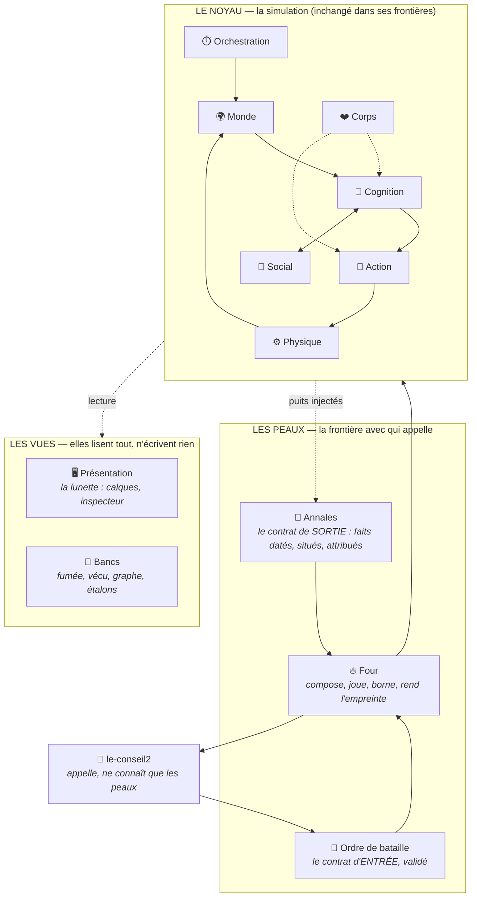

# Proposition — les containers quand `batailles` devient un moteur APPELÉ

**Statut : proposition, rien n'est acté.** Elle se discute avant qu'une ligne soit écrite, selon la méthode du dépôt. Les décisions à trancher sont en §6 ; je n'en tranche aucune ici, je les instruis.

## 1. Ce qui change

Aujourd'hui, `batailles` est une **page qu'on regarde** : `main.js` compose les huit containers et la boucle de frame les fait tourner sous les yeux de quelqu'un. La sortie de la simulation est ce que l'écran montre et ce que l'inspecteur dit.

Demain, `le-conseil2` supprime son moteur de bataille (`bataille2d.js`, 10 511 lignes) et **appelle celui-ci**. Cela change une chose, et une seule, mais elle est structurante :

> **Le consommateur ne regarde pas.** C'est une session LLM qui joue un tour de jeu, qui n'ouvre aucune fenêtre, et qui a besoin d'une réponse *lisible* — pas d'un état final, pas d'un tableau de positions : de ce qui EST ARRIVÉ, à qui, où, à quelle heure.

Les huit containers actuels décrivent bien la simulation. Ce qui leur manque n'est pas une couche de plus à l'intérieur : c'est une **peau** — ce par quoi on entre, ce par quoi on sort, et ce qui exécute sans écran.

## 2. Le graphe proposé

Trois lois, reprises de `le-conseil2` parce qu'elles sont justes et qu'elles nous manquent nommées :

- **La dépendance ne remonte jamais.** Le noyau ne connaît aucune peau ni aucune vue : il reçoit des puits injectés, comme `emettreParole` aujourd'hui.
- **Chaque donnée a un écrivain unique.** Déjà vrai du registre des corps (Intégration + spawn) ; à étendre nommément aux annales (le puits) et à l'ordre de bataille (immuable après validation).
- **Nul appelant ne lit ce qu'il n'a pas reçu.** `le-conseil2` ne voit que ce que les annales disent — jamais une position, jamais un état interne. C'est le brouillard de guerre appliqué à l'API.

## 3. Les trois containers neufs

### 📜 Annales — le container qui manque le plus

**Intention.** Rendre une bataille lisible par qui ne l'a pas regardée : une liste de FAITS datés, situés, attribués. La porte qui cède, un chef qui tombe, une escouade qui rompt, un blessé dans une rue.

**Pourquoi c'est le manque n°1.** `batailles` a une viz par système — c'est sa règle, et elle est bonne pour un humain devant l'écran. Mais **une viz ne se lit pas depuis une autre machine.** Un MJ qui appelle le moteur et reçoit « 47 morts, 130 fuyards » ne peut rien raconter. `le-conseil2` a résolu ça, et sa formule est meilleure que la nôtre : *un comportement qui n'émet rien n'existe pas*. C'est l'`introspect()` obligatoire, mais appliqué aux **faits** au lieu des états — donc plus exigeant, parce qu'un état s'inspecte quand on y pense, un fait doit être émis au moment où il arrive ou il est perdu.

**Ce que leur forme apporte, et qu'il faut reprendre.** Leur `noter()` situe chaque fait **en langage** : `quartier`, `repere`, `pres` (de qui), `temoins`. C'est ce qui rend une annale racontable. Nous avons déjà la moitié de la machine : `cognition/langage/decrire.js` sait dire des croyances en français. Il lui manque un repère de lieu.

**Bornées par construction**, et c'est leur règle : quinze chefs, quinze escouades, une ligne par quartier gagné par la peur. Le seul poste qui suit l'effectif est le blessé — parce que c'est justement la scène qu'on vient chercher.

**Frontière.** Les annales n'ont aucune opinion : elles n'interprètent pas, ne résument pas, ne jugent pas l'issue. Le résumé est le travail de l'appelant.

### 📐 Ordre de bataille — le contrat d'entrée

**Intention.** Un schéma **validé** : effectifs, livrées, armes, postures, terrain, portes, croyances seedées. Il refuse au lieu de deviner.

**Pourquoi un contrat et pas un objet partagé.** Aujourd'hui `scenarios/` est de la donnée JS interne : `main.js` l'importe, et un champ mal nommé se découvre à l'exécution, trois cents hommes plus tard. Un appelant externe — en Python, dans une session LLM, à travers un fichier — n'a pas ce luxe. `le-conseil2` a déjà écrit la forme candidate (`archive/bataille/ordre-de-bataille.json`) et l'a laissée **débranchée exprès** : « rien ne lit ce fichier aujourd'hui, et c'est voulu ». C'est le bon point de départ — il ne reste qu'à le brancher **de ce côté-ci**.

**Ce qu'il écarte.** Que `le-conseil2` importe nos scénarios comme des modules. Cela recréerait le couplage qu'on vient de casser, et dans le mauvais sens : leur jeu dépendrait de la forme interne de notre donnée.

**`scenarios/` devient** un **catalogue d'ordres de bataille** — les nôtres, ceux qu'on joue à la main — dans le même format que ceux qui arrivent du dehors. Un seul format, deux provenances : c'est ce qui garantit qu'un ordre venu du Conseil est jouable exactement comme la Prise de Port-Réal.

### 🔥 Four — l'exécution sans écran

**Intention.** Prendre un ordre de bataille, composer un monde neuf, jouer N secondes à dt fixe, **borner le temps réel**, et rendre `{annales, issue, empreinte}`.

**Ce qu'il ajoute à `fumee.mjs`**, qui en est l'ancêtre direct : la borne (une bataille qui ne converge pas ne doit pas bloquer un tour de jeu), et l'**empreinte** — le hash de la condition et du déroulé, qui permet de dire « c'est la même bataille » sans la rejouer. `le-conseil2` le fait déjà dans `banc-moteur` : « chaîne : 20 fichiers, empreinte d'ensemble bebe7207d743 ».

**Frontière.** Le four ne décide rien de la bataille. Il compose, il tourne, il rend. C'est `main.js` sans la fenêtre — et `main.js` devient *le four plus une vue*, au lieu d'être le seul chemin d'exécution.

## 4. Ce qui bouge dans l'existant

| Container | Ce qui change |
|---|---|
| 🖥️ **Présentation** (32 fichiers, 2 804 l. — le plus gros) | Devient **une vue parmi deux**, plus le point d'entrée. Il ne perd rien ; il cesse d'être sur le chemin critique. |
| `scenarios/` | Devient le catalogue d'ordres de bataille, au format du contrat. |
| `main.js` (388 l.) | Devient `four + présentation`. Il importe aujourd'hui **quatre brains et le livre de manœuvres** individuellement : ce détail remonte trop haut. Un **bestiaire** (le catalogue des brains, dans 🧠) le règle — la composition demande « un soldat », pas un chemin de fichier. |
| `coding/` | Devient le container **🔬 Bancs**, nommé comme tel : `fumee`, `vecu`, `graph` y sont déjà, ils n'ont juste pas de fiche qui les déclare container. |

## 5. Ce qui ne change pas, et qu'il faut protéger

- **Les deux frontières de la 🧠 Cognition** : elle ne voit le monde que par sa perception, n'agit que par intentions. C'est ce qui fait tenir l'émergence ; aucune peau ne doit avoir le droit de la contourner pour « aller plus vite ».
- **Deux écrivains sur le registre des corps.** Le four n'en est pas un troisième : il compose *avant*, il lit *après*.
- **Déterminisme, RNG seedé, dt fixe.** C'est ce qui rend l'empreinte possible ; sans lui, la peau ne vaut rien.
- **Le français partout, la limite de 500 lignes, une viz par système.**

## 6. Les cinq décisions à trancher — je ne les prends pas

**D1 — Le transport.** Processus + JSON sur `stdout` (comme leurs bancs, comme `tick.py`), ou serveur HTTP ? *Ma recommandation : le processus.* Un serveur, c'est un port de plus, un état vivant, et une chose qui peut être éteinte au mauvais moment. Un processus qui prend un fichier et rend du JSON est reproductible, journalisable et se relance. Le coût accepté : ~200 ms de démarrage Node par bataille — négligeable devant une cuisson de plusieurs secondes.

**D2 — Qui possède le terrain ?** Les masques de villes sont cuits par `le-conseil2` (`portreal.masque.bin`) et lus ici. Est-ce que l'ordre de bataille porte **le chemin** du masque (couplage par le disque) ou **les octets** (autonomie, mais un ordre de bataille de plusieurs Mo) ? *Penche pour le chemin*, avec le montage déjà existant.

**D3 — La granularité de l'appel.** Une bataille entière d'un coup (« joue les vingt minutes, rends les annales »), ou un pas de temps à la fois (le MJ peut interrompre, injecter un ordre, faire intervenir un dragon) ? La seconde est bien plus riche et coûte une **session vivante** — donc un serveur, donc D1 rouvert. *À trancher en premier : les quatre autres en dépendent.*

**D4 — L'échelle.** `le-conseil2` joue 2 500 hommes ; notre passe perf tient 633 corps à ~900 ms par seconde de sim. À 2 500, c'est ~4 s de calcul par seconde simulée : une bataille de dix minutes coûte quarante minutes. **Il faudra soit borner l'effectif, soit un LOD** (les unités hors de vue simulées en masse). C'est le sujet technique le plus lourd de la migration, et il ne se découvre pas : il se décide.

**D5 — Le vocabulaire des annales.** Fermé (une liste de types de faits, versionnée) ou ouvert ? *Fermé*, comme les intentions : c'est un contrat avec un autre programme. Un type de fait neuf est un changement de version, pas un ajout silencieux.

## 7. Le premier pas, si la proposition tient

**Les annales, avant tout le reste.** Elles sont utiles immédiatement — même sans `le-conseil2`, une bataille qui raconte ce qui lui arrive est plus facile à déboguer qu'une bataille qu'on regarde — et elles ne demandent aucune décision d'architecture parmi les cinq ci-dessus. Concrètement : un puits `noter(fait)` injecté comme `emettreParole`, une dizaine de types de faits pour commencer (rupture, mort d'un chef, porte cédée, ligne enfoncée), et le calque qui les affiche sur la carte.

Le reste attend D3 : c'est lui qui dit si l'on construit un four ou un serveur.
