# Architecture — vue générée

> Généré par `node coding/graph/construire.mjs`. Ne pas éditer à la main.

8/8 containers implémentés · 114 modules · 84 liens câblés · 52 contrats déclarés · 91/100 features observables · **24 divergences**

**Containers :** [⏱️ Orchestration](#c-orchestration) · [🌍 Monde](#c-monde) · [🧠 Cognition](#c-cognition) · [📯 Social](#c-social) · [❤️ Corps](#c-corps) · [🏃 Action](#c-action) · [⚙️ Physique](#c-physique) · [🖥️ Présentation](#c-presentation)

## Panorama — qui appelle quel expose

Sens de l'**appel**. Aucun container n'en importe un autre : ces arêtes
viennent toutes des littéraux d'injection de `src/main.js`.

- `-->` vue (lecture, tirée par l'appelant)
- `==>` commande (écriture, poussée par l'appelant)
- `-.->` puits (événement poussé vers l'appelé)
- trait rouge : câblé mais vide — trait gris pointillé : déclaré, jamais câblé

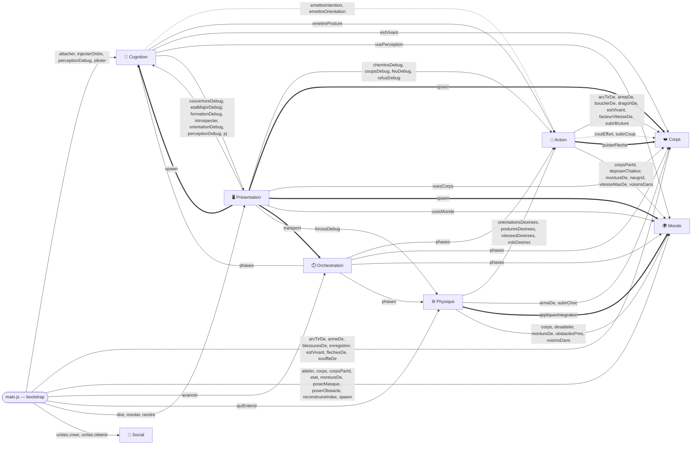

## Panorama — flux de données

Sens du **flux**, pas de l'appel : une vue se tire, donc l'appel remonte
le flux. C'est le sens que décrivent les sections « Reçoit / Fournit ».

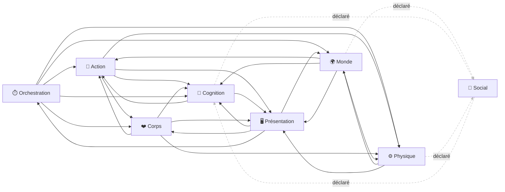

## La boucle

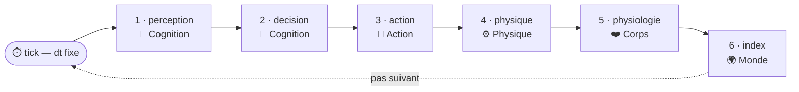

## Machines à états des brains

Dessinées depuis les exports `MACHINE_*` des brains — la donnée dessinée
est exactement celle qui s'exécute (aucun parsing). Au runtime : le
journal des transitions et l'état courant sont dans l'Inspecteur.

### brain `dragon`

États réservés grisés : déclarés sans transition entrante — la feuille
de route est dans le diagramme. Chaque arête porte sa justification.

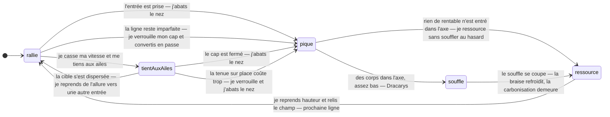
### brain `gregaire`

États réservés grisés : déclarés sans transition entrante — la feuille
de route est dans le diagramme. Chaque arête porte sa justification.

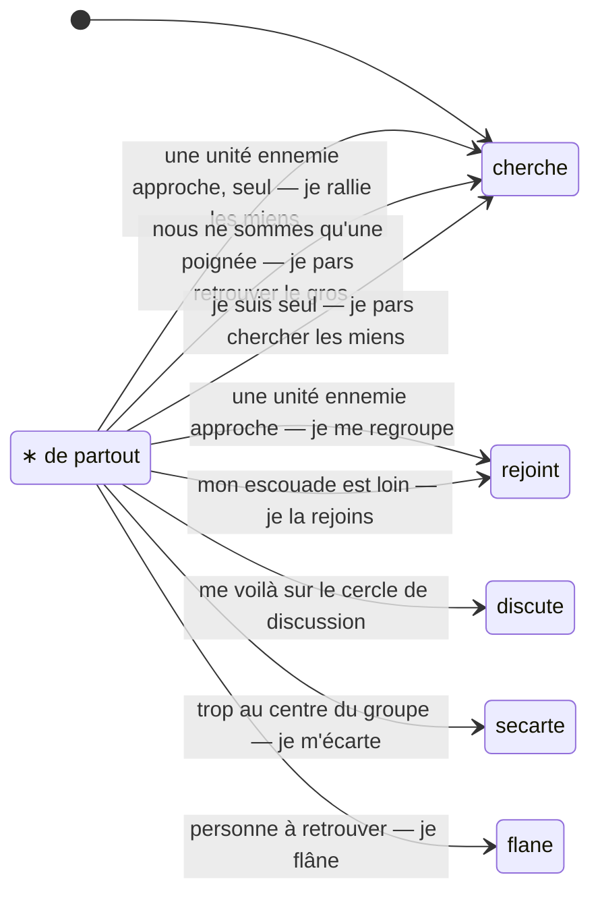
### brain `soldat`

États réservés grisés : déclarés sans transition entrante — la feuille
de route est dans le diagramme. Chaque arête porte sa justification.

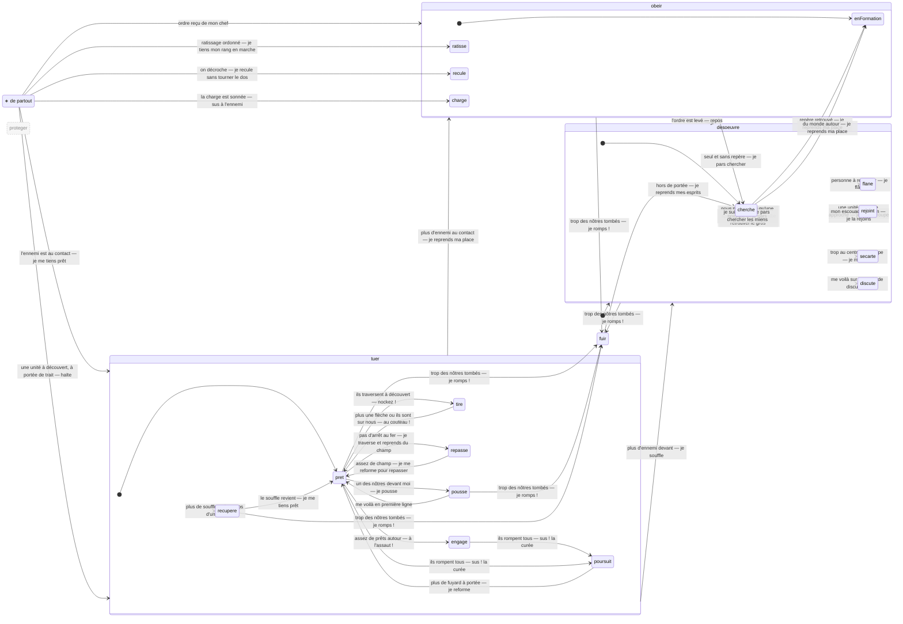

## Observables — chaque feature a-t-elle une viz ?

Déclaré dans les tableaux `## Observables` des CLAUDE.md ; les `calque`
sont vérifiés contre `calques/` et les tags `@viz` ; `inspecteur` et `ui`
sont déclaratifs (contrôle runtime à venir). `—` = à faire.

| Container | Feature | Mécanique | Viz |
|---|---|---|---|
| ⏱️ Orchestration | `pause` | arrêt du temps simulé | ui `transport` |
| ⏱️ Orchestration | `multiplicateur-vitesse` | x1/x2/x5 — nombre de pas par frame | ui `transport` |
| ⏱️ Orchestration | `dt-fixe` | la taille du pas ne change jamais, seul leur nombre varie | **—** |
| ⏱️ Orchestration | `ordre-des-phases` | les 6 phases du tick, dans l'ordre décidé | **—** |
| 🌍 Monde | `registre-corps` | positions et vitesses réelles des corps | calque `hommes` |
| 🌍 Monde | `livree-physique` | l'appartenance se VOIT — couleur = livrée | calque `hommes` |
| 🌍 Monde | `cap` | l'orientation du corps, écrite par l'Intégration (⚙️) | calque `hommes` |
| 🌍 Monde | `nom-panache` | on reconnaît les gens ; le chef se voit de loin | calque `hommes` + calque `perception` |
| 🌍 Monde | `terrain-obstacles` | maisons immobiles qui bloquent | calque `terrain` |
| 🌍 Monde | `terrain-masque` | la ville cuite bloque (1 bit/m²) : spawn refusé, murs répulsifs, navgrid — la porte laisse passer | calque `terrain` |
| 🌍 Monde | `navgrid` | cases libres/bloquées, cache matérialisé à la demande | calque `navgrid` |
| 🌍 Monde | `index-spatial-snapshot` | grille de hachage, photo figée par tick | calque `index` |
| 🌍 Monde | `chaleur-sol` | la trace thermique : braise qui s'éteint (2 constantes), carbonisation qui reste (dose) | calque `dragon` |
| 🧠 Cognition | `perception-bornee` | cercle 360°, portée, budget d'attention | calque `perception` |
| 🧠 Cognition | `perception-masse` | l'horizon de masse : un groupe se voit à POIDS × 20 m (le gabarit, pas l'effectif), effectif à la poignée, ni postures ni forme | calque `perception` |
| 🧠 Cognition | `poids-de-gabarit` | un corps pèse sa taille (rayon) : visibilité des masses et surnombre perçu en POIDS — cheval ~1,7, dragon ~21 | calque `perception` + inspecteur `objectif` |
| 🧠 Cognition | `menace-en-secondes` | tau = distance 3D / allure crue : ce qui vient VITE menace de LOIN — contagion sous le galop et sous le vol | inspecteur `jauges` |
| 🧠 Cognition | `memoire-datee` | croyances vieillissantes, fantômes aux positions crues | calque `perception` + inspecteur `amisFrais` |
| 🧠 Cognition | `amis-seedes` | on connaît ses camarades avant la bataille | inspecteur `amisConnus` |
| 🧠 Cognition | `decision-brain` | brains interchangeables, `decide()` + `introspect()` | inspecteur `brain` |
| 🧠 Cognition | `machine-etats` | la FSM déclarative : états, transitions justifiées, journal | inspecteur `machine` |
| 🧠 Cognition | `machine-vecu` | le vécu cumulé : secondes par état, bascules par transition | **—** |
| 🧠 Cognition | `chercher` | seul ou repère irrésoluble : remonter ses croyances périmées (pistes vérifiées mémorisées, exploration en dernier échelon) — le défaut de l'homme seul | inspecteur `machine` |
| 🧠 Cognition | `menace-regroupement` | tas cru de livrée adverse, frais et proche → se regrouper (rejoint) ou rallier (cherche) — se regrouper n'est PAS fuir | inspecteur `machine` + calque `perception` |
| 🧠 Cognition | `perception-contact` | à portée d'armes (~6 m) on voit des HOMMES, plus une masse — saillance de la menace : l'adverse capte l'attention avant le camarade | calque `perception` |
| 🧠 Cognition | `etat-tuer` | la rencontre (ennemi au contact, pas seul) : pret / engage / pousse / recupere | inspecteur `machine` |
| 🧠 Cognition | `passe-montee` | monté, pas d'arrêt au fer : contact → `tuer.repasse` (traverser, reprendre du champ au trot) → l'ordre CHARGER debout re-tire avec l'élan retrouvé (≥ 22 m de la masse crue) — le cycle charge-dégagement-charge émerge de la machine | inspecteur `machine` |
| 🧠 Cognition | `etat-tire` | l'archer : sa rencontre commence à portée de trait — la volée tant qu'il a cible crue + flèches + personne au contact ; à vide ou au corps, le couteau | inspecteur `machine` + calque `coups` |
| 🧠 Cognition | `readiness-regard` | prêt = posture LEVÉE (fait physique) ; la readiness de ma ligne se lit sur le TAS (lances comptées) | calque `hommes` + inspecteur `objectif` |
| 🧠 Cognition | `rapport-de-force` | prêts crus / adverses au contact — ≥ 1 : l'assaut ; on n'attaque JAMAIS seul | inspecteur `objectif` |
| 🧠 Cognition | `alerte-contact` | un adverse au contact accélère mon re-scan (~3×) — tempo par saillance | inspecteur `prochaineDecisionDansS` |
| 🧠 Cognition | `moral-peur` | pics de récence (morts des miens vus), rapport perçu, contagion des fuyards | inspecteur `jauges` |
| 🧠 Cognition | `etat-fuir` | la rupture : dos tourné, plein pas, loin de l'ennemi cru — rallie une fois hors de danger | calque `hommes` |
| 🧠 Cognition | `etat-poursuite` | la curée : le combat local fini (tous en fuite), courir sus au fuyard — un dos ne tient plus la mesure (garde ⚙️) et prend TRIPLE | calque `coups` |
| 🧠 Cognition | `cadence-decision` | période ~N(0.5 Hz) propre à chaque homme | inspecteur `prochaineDecisionDansS` |
| 🧠 Cognition | `cadence-perception` | ~N(2 Hz) échelonnée — levier de scale n°1 | **—** |
| 🧠 Cognition | `intentions` | vocabulaire fermé vers 🏃 | inspecteur `cible` + calque `chemins` |
| 🧠 Cognition | `cercle-discussion` | cercle autour du barycentre cru, anti-hug | inspecteur `etat` |
| 🧠 Cognition | `groupe-reduit` | le tas cru sous la moitié de l'attendu connu → pas regroupé, on part retrouver le gros | inspecteur `machine` |
| 🧠 Cognition | `perception-tas` | groupes physiques perçus comme UN objet (barycentre, effectif) | calque `perception` |
| 🧠 Cognition | `attention-dirigee` | on cherche son chef / son ancre du regard | calque `perception` |
| 🧠 Cognition | `soldat-fsm` | objectif obeir / desoeuvre (tuer/proteger/fuir réservés) | inspecteur `etat` |
| 🧠 Cognition | `ancrage-relationnel` | doctrine rangs : « derrière X, à droite de Y » | calque `formation` |
| 🧠 Cognition | `objectif-humain` | l'objectif en français, jamais en coordonnées | inspecteur `objectif` |
| 🧠 Cognition | `ordre-formation` | échafaudage : toggle En formation / Repos | ui `ordres` |
| 🧠 Cognition | `orientation-arbitrage` | où vais-je / vers les gens / comme les gens, pondérés | calque `orientation` |
| 🧠 Cognition | `etat-major` | la délibération du commandant : faits, candidates × scores, engagée + phase, justification — et sa CARTE (axe de menace, ligne de barrage, destination, poste) | inspecteur `etat-major` + calque `etat-major` |
| 🧠 Cognition | `manoeuvres` | le livre en donnée : applicabilité (faits), géométrie, phases à critères nommés (relance/repete/conclusion) | inspecteur `etat-major` |
| 🧠 Cognition | `couverture` | le brouillard de guerre personnel : où j'ai regardé, quand | calque `couverture` |
| 🧠 Cognition | `ratissage-bonds` | chaque cri RATISSER = un bond de secteur figé à l'écoute ; le serpentin = la succession des cris | calque `formation` |
| 🧠 Cognition | `rumeur-directionnelle` | la croyance seedée porte une direction (mot) → biais continu du choix des secteurs | inspecteur `etat-major` |
| 🧠 Cognition | `manoeuvre-charger` | ennemi localisé → « Chargez ! » : chacun court sur SA croyance d'ennemi (la direction criée sinon) ; la mêlée vue conclut | inspecteur `machine` |
| 🧠 Cognition | `orientation-facer` | flag qui inverse les pondérations : on FACE (locuteur, interlocuteurs, ennemis à venir) | calque `orientation` |
| 🧠 Cognition | `forme-tas` | la forme SE PERÇOIT : cap par les lances, netteté, largeur/profondeur, première ligne | calque `perception` |
| 🧠 Cognition | `langage-resolution` | parole → math : le repère d'un ordre résolu contre MES croyances (sur moi / première ligne auto-référente / amorçage) | calque `formation` |
| 🧠 Cognition | `langage-description` | math → parole : les croyances décrites en français | calque `perception` + inspecteur `escouadeCrue` |
| 🧠 Cognition | `competences` | le COMMENT rangé — contrat commun, objectifHumain obligatoire | inspecteur `objectif` |
| 🧠 Cognition | `paroles-flavor` | la surcouche de parole : cris aux bascules, seuils de jauges avec hystérésis, bavardage et défis à cadence ~N — sans mécanique (personne n'écoute encore) | calque `bulles` + inspecteur `dernieresParoles` |
| 📯 Social | `unite-drill` | ordreDrill = les habitudes avant/arrière rendues mécaniques | calque `formation` |
| 📯 Social | `forme-ouverte` | la forme cible, donnée au niveau unité | calque `formation` |
| ❤️ Corps | `equipement-lance` | lance par défaut = l'orientation se voit | calque `hommes` |
| ❤️ Corps | `armes-differenciees` | pique 4,5 m / épée : allonge, arc, réarmement, coût de garde PAR ARME — la garde ⚙️ est asymétrique (chacun craint la pointe ADVERSE) | calque `hommes` + calque `forces` |
| ❤️ Corps | `bouclier-parade` | coup frontal dans l'arc couvert → CLANG, pas de blessure | calque `hommes` + calque `coups` |
| ❤️ Corps | `souffle-sigmoide` | réserve linéaire, ressenti en S — ~45 s d'engagement, bascule à ~35 % | inspecteur `souffle` |
| ❤️ Corps | `blessures` | coups reçus comptés ; la vitesse baisse à chaque coup (plancher — on boite) | calque `hommes` + inspecteur `blessures` |
| ❤️ Corps | `mort-gisant` | au seuil de coups : constat ❤️, geste `gisant`, cadavre figé sur le champ | calque `hommes` |
| ❤️ Corps | `arc-et-carquois` | l'arc = un projecteur de ZONE (pas d'arme de mêlée) ; les flèches COMPTÉES par carquois — puiser refuse à vide | inspecteur `fleches` + calque `coups` |
| 🏃 Action | `acte-frapper` | la cible est nommée, l'allonge et l'arc décident — ami compris ; la FENTE porte le corps en avant le temps du geste | calque `coups` + calque `hommes` |
| 🏃 Action | `refus-monture` | le RÉFLEXE du cheval : pointes levées adverses dans la fenêtre de regard (pique plein, épée peu) → freinage continu + dérobade vers le côté le moins hérissé — les murs de piques TIENNENT sans une règle de plus | calque `hommes` |
| 🏃 Action | `train-de-monture` | l'intention porte un `train` ('pas'/'trot'/'galop') : le cavalier parle à sa monture — la vitesse max est PAR CORPS ; à pied le mot est ignoré | **—** |
| 🏃 Action | `acte-tirer` | la volée sur une ZONE crue : cadence par arc, flèche puisée (refus à vide), dispersion en cône, la flèche touche QUI est là — ami compris | calque `coups` |
| 🏃 Action | `pathfinding-astar` | chemin trouvé sur la navgrid | calque `chemins` |
| 🏃 Action | `suivi-chemin` | waypoint courant, vitesse désirée | calque `chemins` |
| 🏃 Action | `lissage-chemin` | string-pulling : crans 45° → vrais coins | **—** |
| 🏃 Action | `echec-intention` | signalement d'une intention irréalisable | **—** |
| 🏃 Action | `vol-banque` | l'intention de vol bornée par le profil : virage coordonné banqué, vol lent battu, altitude et vitesse filtrées, piqué énergétique (interception du plan de tir, la hauteur devient vitesse) — l'état réalisable écrit par ⚙️ | calque `dragon` |
| 🏃 Action | `dracarys` | le cône-sol exact juge qui brûle : doses vers ❤️ (le noyau met hors de combat, le bord marque), trace vers 🌍 — les passes ratées ressourcent sans brûler le vide | calque `dragon` + calque `hommes` |
| ⚙️ Physique | `repulsion-douce` | murs et hommes repoussent, profil linéaire | calque `forces` |
| ⚙️ Physique | `collision-dure` | personne ne se traverse, relaxation itérative | calque `forces` |
| ⚙️ Physique | `inertie` | vitesse qui converge sous `accelMax` — demi-tour en arc | calque `forces` |
| ⚙️ Physique | `cap-integre` | rotation BORNÉE (`rotationMax`) vers le cap désiré (🧠 via 🏃) ; sans désir : sens de marche, conservé à l'arrêt | calque `hommes` |
| ⚙️ Physique | `marche-arriere-lente` | vitesse bornée quand elle s'oppose au cap — fuir vite exige de tourner le dos | calque `hommes` |
| ⚙️ Physique | `repousse-gisants` | les morts repoussent doucement les vivants — on enjambe, on ne piétine pas (unidirectionnel) | calque `forces` |
| ⚙️ Physique | `choc-renverse` | quantité de mouvement conservée au choc de charge — le léger est renversé (posture `renverse`), pas le lourd | calque `hommes` |
| ⚙️ Physique | `charge-montee` | le galop percute : Δv échangé au choc → renversés en chaîne, TRAUMA poussé vers ❤️ (la physiologie juge la gravité) ; le mort tombe de selle | calque `forces` + calque `hommes` |
| ⚙️ Physique | `attelage` | le cavalier est PORTÉ : hors forces/collisions, position/vitesse/cap = sa monture ; il VEUT, elle PORTE (sa vitesse désirée passe au corps qui la réalise) ; monture morte → à pied, monture renversée → cavalier à terre | calque `hommes` |
| ⚙️ Physique | `curee-rattrapable` | un dos en fuite n'émet plus de garde (sa pointe ne menace personne) — le fuyard se rattrape, et la pointe adverse le pousse | **—** |
| ⚙️ Physique | `garde-de-lance` | livrées adverses repoussées à allonge + 20 cm (centre à centre) — la MESURE d'escrime ; la fente (🏃) la perce | calque `forces` |
| ⚙️ Physique | `coude-a-coude` | côte à côte + caps parallèles → attraction latérale vers l'épaulement — FAITS géométriques, aucun flag « formation », aucune livrée ; les lignes ennemies (caps opposés) s'ignorent | calque `forces` |
| ⚙️ Physique | `acoustique` | portée de voix (murmure 2 m / parole 8 m / cri 25 m) : `quiEntend(pos, {intensite})` rend les corps à portée ; atténuation par les murs et bruit de mêlée à venir | calque `bulles` |
| 🖥️ Présentation | `selection` | anneau autour de l'homme cliqué | calque `selection` |
| 🖥️ Présentation | `camera` | zoom molette, pan drag, mètres↔pixels | intrinsèque |
| 🖥️ Présentation | `spawn-refuse` | un spawn sur un obstacle est refusé | **—** |
| 🖥️ Présentation | `calques-activables` | chaque calque peut s'allumer/s'éteindre | ui `calques` |
| 🖥️ Présentation | `bulles-paroles` | paroles éphémères au-dessus des corps, vieillies au temps sim — viz de la comm 📯 à venir | calque `bulles` |
| 🖥️ Présentation | `terrain-ville` | le plan cuit d'une ville (le-conseil2) rendu en raster caché à deux niveaux (ville entière au loin, fenêtre fine sous la caméra) — du DESSIN ; la vérité reste le masque (🌍) | calque `terrain` |
| 🖥️ Présentation | `scenario-selecteur` | le catalogue des scénarios ; choisir = recomposer un monde NEUF (jamais de reset in place) | ui `scenarios` |
| 🖥️ Présentation | `lignes-de-front` | debug vérité-terrain : le contour du front par camp (courbe), envergure (m), % de trous, perpendiculaire centrale (axe de menace, distance) | calque `lignes` |
| 🖥️ Présentation | `inspecteur-redimensionnable` | panneau droit élargissable à la poignée (bord gauche) | ui `inspecteur` |
| 🖥️ Présentation | `calque-dragon` | ✅ passes vol + feu : silhouette battante (robe ❤️), ombre portée par z + pointillé, étiquette d'altitude, altimètre, path coloré par altitude, flamme (fuseau chaud), empreinte cône-sol (les cordes exactes), chaleur 🌍 (braise/carbonisation). ⏸️ à venir : couloirs de la délibération | calque `dragon` |

## Divergences déclaré / réel

| Type | Containers | Constat |
|---|---|---|
| `declare-non-cable` | monde → social | Monde → Social : déclaré (portées, positions (Index spatial) — à venir) mais absent du câblage. |
| `declare-non-cable` | social → cognition | Social → Cognition : déclaré (ordres et messages délivrés) mais absent du câblage. |
| `declare-non-cable` | cognition → social | Cognition → Social : déclaré (émission d'ordres (si chef)) mais absent du câblage. |
| `declare-non-cable` | physique → social | Physique → Social : déclaré (les lois acoustiques (`acoustique/portee-voix.js`, première passe : `quiEntend` = les corps à portée, sans atténuation) — la propagation d'une parole est un fait physique. Reçoit pour cela le voisinage du container 🌍 Monde (`voisinsDans`). Premier consommateur réel : la boîte de parole de la page — ce qu'un homme dit depuis la carte est entendu de tous ceux à portée, et d'eux seuls) mais absent du câblage. |
| `declaration-unilaterale` | physique → social | Physique → Social : déclaré seulement par Physique, le pair ne le mentionne pas. |
| `feature-sans-viz` | orchestration | `dt-fixe` (la taille du pas ne change jamais, seul leur nombre varie) n'a aucune représentation visuelle. |
| `feature-sans-viz` | orchestration | `ordre-des-phases` (les 6 phases du tick, dans l'ordre décidé) n'a aucune représentation visuelle. |
| `feature-sans-viz` | cognition | `machine-vecu` (le vécu cumulé : secondes par état, bascules par transition) n'a aucune représentation visuelle. |
| `feature-sans-viz` | cognition | `cadence-perception` (~N(2 Hz) échelonnée — levier de scale n°1) n'a aucune représentation visuelle. |
| `feature-sans-viz` | action | `train-de-monture` (l'intention porte un `train` ('pas'/'trot'/'galop') : le cavalier parle à sa monture — la vitesse max est PAR CORPS ; à pied le mot est ignoré) n'a aucune représentation visuelle. |
| `feature-sans-viz` | action | `lissage-chemin` (string-pulling : crans 45° → vrais coins) n'a aucune représentation visuelle. |
| `feature-sans-viz` | action | `echec-intention` (signalement d'une intention irréalisable) n'a aucune représentation visuelle. |
| `viz-non-revendiquee` | physique → presentation | `charge-montee` dit être montré par le calque `forces`, mais son @viz ne le revendique pas. |
| `viz-non-revendiquee` | physique → presentation | `charge-montee` dit être montré par le calque `hommes`, mais son @viz ne le revendique pas. |
| `feature-sans-viz` | physique | `curee-rattrapable` (un dos en fuite n'émet plus de garde (sa pointe ne menace personne) — le fuyard se rattrape, et la pointe adverse le pousse) n'a aucune représentation visuelle. |
| `feature-sans-viz` | presentation | `spawn-refuse` (un spawn sur un obstacle est refusé) n'a aucune représentation visuelle. |
| `viz-orpheline` | presentation | Le calque `hommes` revendique `bras`, absent de tout tableau Observables. |
| `viz-orpheline` | presentation | Le calque `hommes` revendique `renes`, absent de tout tableau Observables. |
| `viz-orpheline` | presentation | Le calque `hommes` revendique `robe-cheval`, absent de tout tableau Observables. |
| `viz-orpheline` | presentation | Le calque `hommes` revendique `pennon`, absent de tout tableau Observables. |
| `viz-orpheline` | presentation | Le calque `hommes` revendique `usure-visible`, absent de tout tableau Observables. |
| `viz-orpheline` | presentation | Le calque `hommes` revendique `arbalete`, absent de tout tableau Observables. |
| `viz-orpheline` | presentation | Le calque `ordres-donnes` revendique `ordres-donnes`, absent de tout tableau Observables. |
| `viz-orpheline` | presentation | Le calque `terrain` revendique `terrain-sol`, absent de tout tableau Observables. |

## ⏱️ Orchestration

Possède le temps et l'ordre d'exécution des phases

3 modules — [`src/orchestration/CLAUDE.md`](../../src/orchestration/CLAUDE.md)

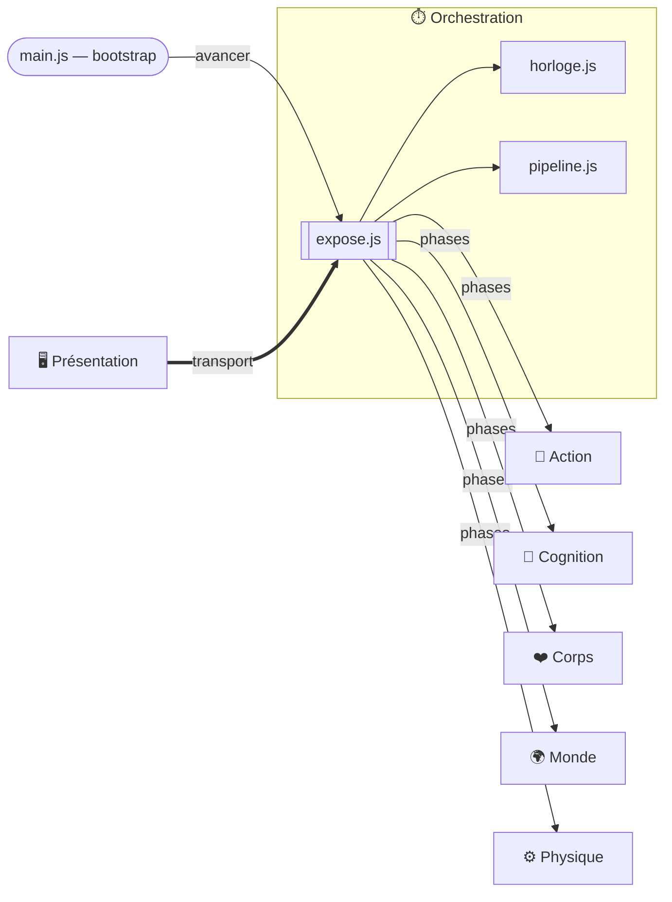

| Sens | Pair | Charge |
|---|---|---|
| reçoit | presentation | commandes pause / vitesse (transport) |
| fournit | _tous_ | la cadence (tick, dt) |

## 🌍 Monde

La vérité objective : terrain, positions réelles des corps

7 modules — [`src/monde/CLAUDE.md`](../../src/monde/CLAUDE.md)

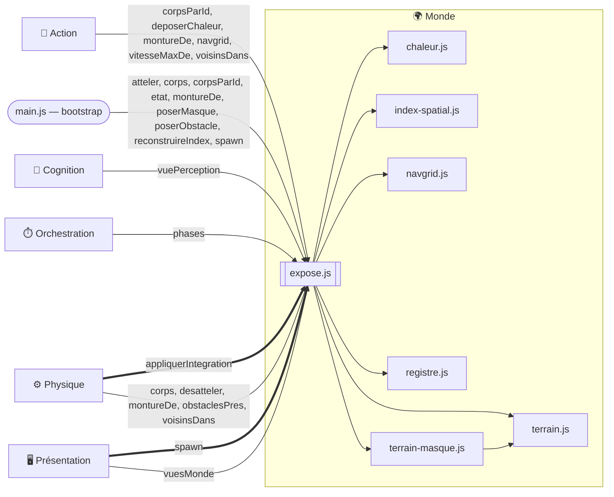

| Sens | Pair | Charge |
|---|---|---|
| reçoit | physique | les nouvelles positions (Intégration) |
| reçoit | presentation | les spawns (drag & drop) |
| fournit | cognition | lectures filtrées et bornées |
| fournit | cognition | voisinages (Index spatial, snapshot du tick) |
| fournit | social | portées, positions (Index spatial) — à venir |
| fournit | action | la NavGrid |
| fournit | physique | géométrie des murs, voisinages |
| fournit | presentation | tout l'état, en lecture |

## 🧠 Cognition

Le cerveau de chaque homme : perception → représentation → décision → intentions

43 modules — [`src/cognition/CLAUDE.md`](../../src/cognition/CLAUDE.md)

```mermaid
flowchart LR
  subgraph cognition["🧠 Cognition"]
    direction TB
    subgraph cognition__brains["brains/"]
      direction TB
      cognition_brains_cadence["cadence.js"]
      cognition_brains_machine["machine.js"]
      cognition_brains_random_walk["random-walk.js"]
    end
    subgraph cognition__brains_commandant["brains/commandant/"]
      direction TB
      cognition_brains_commandant_arbitre["arbitre.js"]
      cognition_brains_commandant_brain["brain.js"]
      cognition_brains_commandant_estimation["estimation.js"]
      cognition_brains_commandant_projection["projection.js"]
    end
    subgraph cognition__brains_dragon["brains/dragon/"]
      direction TB
      cognition_brains_dragon_brain["brain.js"]
      cognition_brains_dragon_couloirs["couloirs.js"]
      cognition_brains_dragon_machine["machine.js"]
    end
    subgraph cognition__brains_gregaire["brains/gregaire/"]
      direction TB
      cognition_brains_gregaire_brain["brain.js"]
      cognition_brains_gregaire_machine["machine.js"]
    end
    subgraph cognition__brains_soldat["brains/soldat/"]
      direction TB
      cognition_brains_soldat_brain["brain.js"]
      cognition_brains_soldat_machine["machine.js"]
    end
    subgraph cognition__competences["competences/"]
      direction TB
      cognition_competences_charger["charger.js"]
      cognition_competences_chercher["chercher.js"]
      cognition_competences_combattre["combattre.js"]
      cognition_competences_flaner["flaner.js"]
      cognition_competences_monter["monter.js"]
      cognition_competences_moral["moral.js"]
      cognition_competences_se_mettre_en_formation["se-mettre-en-formation.js"]
      cognition_competences_se_regrouper["se-regrouper.js"]
      cognition_competences_tirer["tirer.js"]
    end
    cognition_couverture["couverture.js"]
    cognition_expose[[expose.js]]
    cognition_intentions["intentions.js"]
    cognition_orientation["orientation.js"]
    cognition_paroles["paroles.js"]
    cognition_representation["representation.js"]
    subgraph cognition__doctrine_formes["doctrine/formes/"]
      direction TB
      cognition_doctrine_formes_rangs["rangs.js"]
    end
    subgraph cognition__doctrine_manoeuvres["doctrine/manoeuvres/"]
      direction TB
      cognition_doctrine_manoeuvres_charger["charger.js"]
      cognition_doctrine_manoeuvres_harceler["harceler.js"]
      cognition_doctrine_manoeuvres_livre["livre.js"]
      cognition_doctrine_manoeuvres_ratisser["ratisser.js"]
      cognition_doctrine_manoeuvres_se_reformer["se-reformer.js"]
      cognition_doctrine_manoeuvres_tenir["tenir.js"]
    end
    subgraph cognition__langage["langage/"]
      direction TB
      cognition_langage_decrire["decrire.js"]
      cognition_langage_repliques["repliques.js"]
      cognition_langage_resoudre_lieu["resoudre-lieu.js"]
    end
    subgraph cognition__perception["perception/"]
      direction TB
      cognition_perception_attention["attention.js"]
      cognition_perception_clusters["clusters.js"]
      cognition_perception_forme_tas["forme-tas.js"]
      cognition_perception_percevoir["percevoir.js"]
    end
  end
  bootstrap -->|"attacher, injecterOrdre, perceptionDebug, piloter"| cognition_expose
  cognition_expose -.->|"emettreIntention, emettreOrientation"| action
  cognition_expose -->|"emettrePosture"| action
  cognition_expose -->|"estVivant"| corps
  cognition_expose -->|"vuePerception"| monde
  cognition_expose -->|"emettreParole"| presentation
  orchestration -->|"phases"| cognition_expose
  presentation -->|"couvertureDebug, etatMajorDebug, formationDebug, introspecter, orientationDebug, perceptionDebug, pj"| cognition_expose
  presentation ==>|"spawn"| cognition_expose
  bootstrap(["main.js — bootstrap"]);
  action["🏃 Action"];
  corps["❤️ Corps"];
  monde["🌍 Monde"];
  presentation["🖥️ Présentation"];
  orchestration["⏱️ Orchestration"];
  cognition_brains_commandant_arbitre --> cognition_brains_commandant_estimation
  cognition_brains_commandant_arbitre --> cognition_brains_commandant_projection
  cognition_brains_commandant_arbitre --> cognition_langage_decrire
  cognition_brains_commandant_brain --> cognition_brains_soldat_brain
  cognition_brains_commandant_brain --> cognition_brains_cadence
  cognition_brains_commandant_brain --> cognition_brains_commandant_arbitre
  cognition_brains_commandant_estimation --> cognition_langage_resoudre_lieu
  cognition_brains_dragon_brain --> cognition_brains_cadence
  cognition_brains_dragon_brain --> cognition_brains_machine
  cognition_brains_dragon_brain --> cognition_brains_dragon_machine
  cognition_brains_dragon_machine --> cognition_intentions
  cognition_brains_gregaire_brain --> cognition_brains_cadence
  cognition_brains_gregaire_brain --> cognition_brains_machine
  cognition_brains_gregaire_brain --> cognition_langage_decrire
  cognition_brains_gregaire_brain --> cognition_competences_chercher
  cognition_brains_gregaire_brain --> cognition_paroles
  cognition_brains_gregaire_brain --> cognition_brains_gregaire_machine
  cognition_brains_gregaire_machine --> cognition_competences_flaner
  cognition_brains_gregaire_machine --> cognition_competences_se_regrouper
  cognition_brains_gregaire_machine --> cognition_competences_chercher
  cognition_brains_random_walk --> cognition_intentions
  cognition_brains_random_walk --> cognition_brains_cadence
  cognition_brains_soldat_brain --> cognition_brains_cadence
  cognition_brains_soldat_brain --> cognition_brains_machine
  cognition_brains_soldat_brain --> cognition_competences_se_mettre_en_formation
  cognition_brains_soldat_brain --> cognition_competences_chercher
  cognition_brains_soldat_brain --> cognition_langage_decrire
  cognition_brains_soldat_brain --> cognition_competences_moral
  cognition_brains_soldat_brain --> cognition_paroles
  cognition_brains_soldat_brain --> cognition_brains_soldat_machine
  cognition_brains_soldat_machine --> cognition_brains_gregaire_machine
  cognition_brains_soldat_machine --> cognition_competences_combattre
  cognition_brains_soldat_machine --> cognition_competences_se_regrouper
  cognition_brains_soldat_machine --> cognition_competences_moral
  cognition_brains_soldat_machine --> cognition_competences_tirer
  cognition_brains_soldat_machine --> cognition_competences_charger
  cognition_brains_soldat_machine --> cognition_competences_monter
  cognition_brains_soldat_machine --> cognition_langage_resoudre_lieu
  cognition_competences_charger --> cognition_intentions
  cognition_competences_charger --> cognition_langage_resoudre_lieu
  cognition_competences_chercher --> cognition_intentions
  cognition_competences_combattre --> cognition_intentions
  cognition_competences_flaner --> cognition_intentions
  cognition_competences_monter --> cognition_intentions
  cognition_competences_moral --> cognition_intentions
  cognition_competences_moral --> cognition_competences_combattre
  cognition_competences_se_mettre_en_formation --> cognition_intentions
  cognition_competences_se_mettre_en_formation --> cognition_doctrine_formes_rangs
  cognition_competences_se_mettre_en_formation --> cognition_langage_resoudre_lieu
  cognition_competences_se_regrouper --> cognition_intentions
  cognition_competences_tirer --> cognition_intentions
  cognition_competences_tirer --> cognition_competences_combattre
  cognition_doctrine_manoeuvres_livre --> cognition_doctrine_manoeuvres_ratisser
  cognition_doctrine_manoeuvres_livre --> cognition_doctrine_manoeuvres_charger
  cognition_doctrine_manoeuvres_livre --> cognition_doctrine_manoeuvres_tenir
  cognition_doctrine_manoeuvres_livre --> cognition_doctrine_manoeuvres_harceler
  cognition_doctrine_manoeuvres_livre --> cognition_doctrine_manoeuvres_se_reformer
  cognition_expose --> cognition_representation
  cognition_expose --> cognition_couverture
  cognition_expose --> cognition_perception_percevoir
  cognition_expose --> cognition_orientation
  cognition_expose --> cognition_langage_decrire
  cognition_paroles --> cognition__infra_rng
  cognition_paroles --> cognition_langage_repliques
  cognition_perception_percevoir --> cognition_perception_clusters
  cognition_perception_percevoir --> cognition_perception_attention
  cognition_perception_percevoir --> cognition_perception_forme_tas
```

| Sens | Pair | Charge |
|---|---|---|
| reçoit | monde | percepts |
| reçoit | social | ordres et messages délivrés |
| reçoit | corps | fatigue, état ressenti — la Décision en dépend |
| reçoit | action | signalement des intentions irréalisables |
| reçoit | presentation | l'attache d'un brain à chaque spawn (composée au bootstrap) |
| fournit | action | intentions |
| fournit | social | émission d'ordres (si chef) |
| fournit | presentation | introspection |
| fournit | presentation | paroles émises (bulles — la surcouche de flavor ; demain la Transmission 📯, la voix qui porte) |

## 📯 Social

La cognition-à-cognition médiée par le physique : hiérarchie, ordres, transmission

3 modules — [`src/social/CLAUDE.md`](../../src/social/CLAUDE.md)

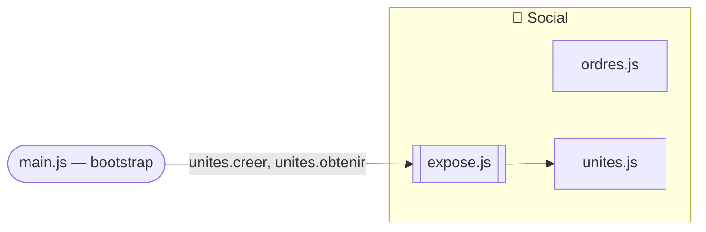

| Sens | Pair | Charge |
|---|---|---|
| reçoit | cognition | ordres à émettre |
| reçoit | monde | portées, positions, obstacles au son |
| fournit | cognition | messages délivrés comme percepts |

## ❤️ Corps

L'état physiologique interne : stamina, blessures, traits

7 modules — [`src/corps/CLAUDE.md`](../../src/corps/CLAUDE.md)

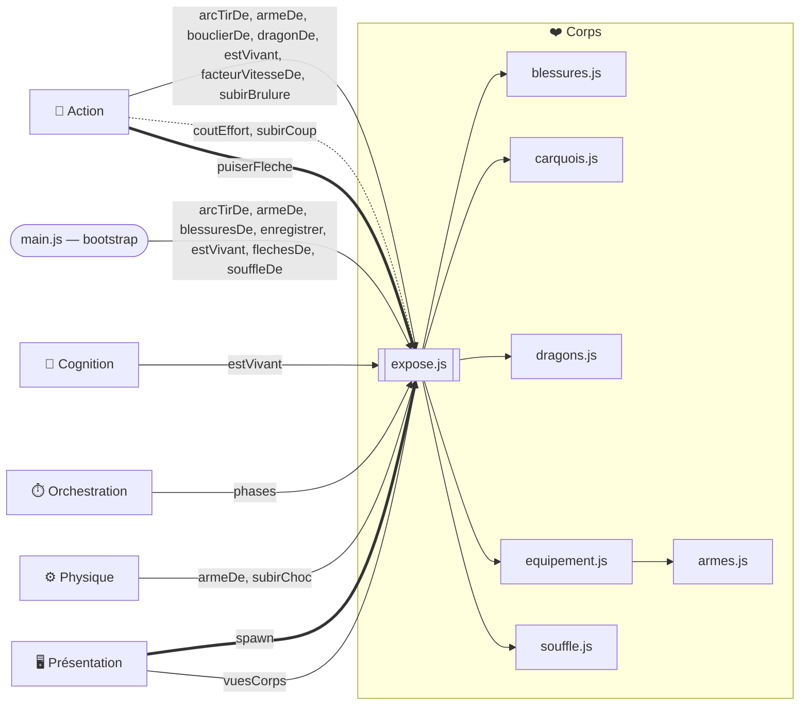

| Sens | Pair | Charge |
|---|---|---|
| reçoit | action | coûts (dépense de stamina, blessures) |
| reçoit | presentation | l'enregistrement de chaque spawn (composé au bootstrap) |
| fournit | cognition | fatigue, état ressenti |
| fournit | presentation | l'équipement porté |
| fournit | action | vitesse max effective, capacités réduites |
| fournit | physique | l'arme portée (`armeDe`) — la garde est asymétrique par arme (allonge, coût) |

## 🏃 Action

Le traducteur : intentions abstraites → vitesses désirées concrètes

7 modules — [`src/action/CLAUDE.md`](../../src/action/CLAUDE.md)

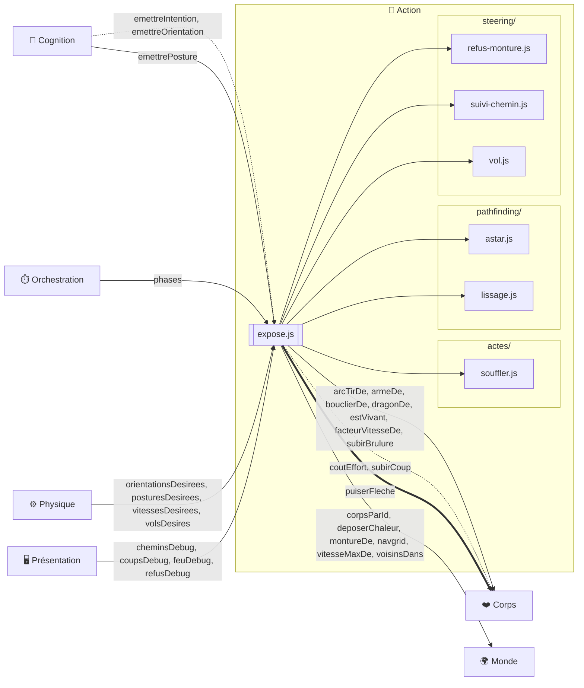

| Sens | Pair | Charge |
|---|---|---|
| reçoit | cognition | intentions |
| reçoit | monde | réponses aux requêtes de chemin |
| reçoit | corps | vitesse max effective |
| fournit | physique | vitesses désirées, impulsions, états de vol réalisables (`volsDesires`) |
| reçoit | corps | le profil de dragon porté (`dragonDe`) — l'actuateur de vol s'y borne |
| fournit | corps | coûts des actes |
| fournit | cognition | signalement des intentions irréalisables |
| fournit | presentation | chemins et cibles courants |

## ⚙️ Physique

Bête et incorruptible : forces, collisions, intégration — seul écrivain régulier des positions

9 modules — [`src/physique/CLAUDE.md`](../../src/physique/CLAUDE.md)

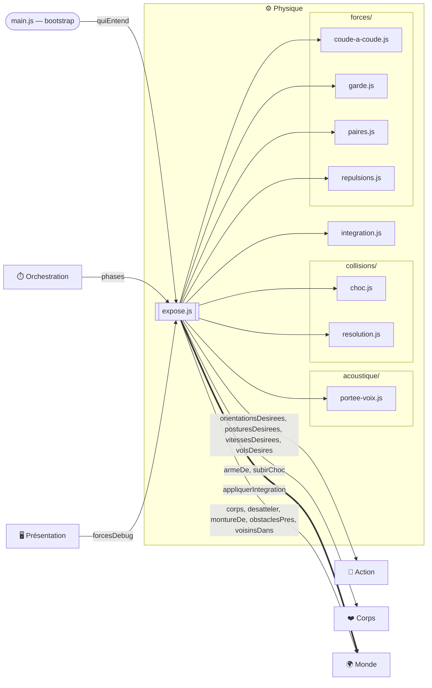

| Sens | Pair | Charge |
|---|---|---|
| reçoit | action | vitesses désirées, impulsions |
| reçoit | monde | géométrie des murs (Terrain), voisinages (Index spatial) |
| reçoit | corps | l'arme portée (`armeDe`) — la garde est asymétrique par arme (allonge, coût) |
| fournit | monde | positions et vitesses écrites (Registre des corps) — avec le spawn du container 🖥️ Présentation, l'un des deux seuls points d'écriture |
| fournit | presentation | vue debug du dernier tick — vitesses désirées, corrections de collision, portées des champs |
| fournit | social | les lois acoustiques (`acoustique/portee-voix.js`, première passe : `quiEntend` = les corps à portée, sans atténuation) — la propagation d'une parole est un fait physique. Reçoit pour cela le voisinage du container 🌍 Monde (`voisinsDans`). Premier consommateur réel : la boîte de parole de la page — ce qu'un homme dit depuis la carte est entendu de tous ceux à portée, et d'eux seuls |

## 🖥️ Présentation

Fenêtre et télécommande : rendu, UI, inspecteur — la sim tourne headless sans elle

35 modules — [`src/presentation/CLAUDE.md`](../../src/presentation/CLAUDE.md)

```mermaid
flowchart LR
  subgraph presentation["🖥️ Présentation"]
    direction TB
    presentation_bulles["bulles.js"]
    presentation_camera["camera.js"]
    presentation_expose[[expose.js]]
    presentation_renderer["renderer.js"]
    presentation_vignettes["vignettes.js"]
    subgraph presentation__calques["calques/"]
      direction TB
      presentation_calques_bulles["bulles.js"]
      presentation_calques_chemins["chemins.js"]
      presentation_calques_coups["coups.js"]
      presentation_calques_couverture["couverture.js"]
      presentation_calques_dragon["dragon.js"]
      presentation_calques_etat_major["etat-major.js"]
      presentation_calques_forces["forces.js"]
      presentation_calques_formation["formation.js"]
      presentation_calques_hommes["hommes.js"]
      presentation_calques_index["index.js"]
      presentation_calques_lignes["lignes.js"]
      presentation_calques_navgrid["navgrid.js"]
      presentation_calques_ordres_donnes["ordres-donnes.js"]
      presentation_calques_orientation["orientation.js"]
      presentation_calques_perception["perception.js"]
      presentation_calques_selection["selection.js"]
      presentation_calques_terrain["terrain.js"]
    end
    subgraph presentation__interactions["interactions/"]
      direction TB
      presentation_interactions_depot["depot.js"]
      presentation_interactions_navigation["navigation.js"]
      presentation_interactions_pilotage["pilotage.js"]
      presentation_interactions_redimension["redimension.js"]
      presentation_interactions_selection["selection.js"]
    end
    subgraph presentation__ui["ui/"]
      direction TB
      presentation_ui_etat_major["etat-major.js"]
      presentation_ui_inspecteur["inspecteur.js"]
      presentation_ui_layout["layout.js"]
      presentation_ui_machine_graphe["machine-graphe.js"]
      presentation_ui_menu_gauche["menu-gauche.js"]
      presentation_ui_ordres["ordres.js"]
      presentation_ui_scenarios["scenarios.js"]
      presentation_ui_transport["transport.js"]
    end
  end
  bootstrap -->|"dire, monter, rendre"| presentation_expose
  cognition -->|"emettreParole"| presentation_expose
  presentation_expose -->|"cheminsDebug, coupsDebug, feuDebug, refusDebug"| action
  presentation_expose -->|"couvertureDebug, etatMajorDebug, formationDebug, introspecter, orientationDebug, perceptionDebug, pj"| cognition
  presentation_expose ==>|"spawn"| cognition
  presentation_expose ==>|"spawn"| corps
  presentation_expose -->|"vuesCorps"| corps
  presentation_expose ==>|"spawn"| monde
  presentation_expose -->|"vuesMonde"| monde
  presentation_expose ==>|"transport"| orchestration
  presentation_expose -->|"forcesDebug"| physique
  bootstrap(["main.js — bootstrap"]);
  cognition["🧠 Cognition"];
  action["🏃 Action"];
  corps["❤️ Corps"];
  monde["🌍 Monde"];
  orchestration["⏱️ Orchestration"];
  physique["⚙️ Physique"];
  presentation_calques_hommes --> presentation_vignettes
  presentation_expose --> presentation_camera
  presentation_expose --> presentation_renderer
  presentation_expose --> presentation_calques_terrain
  presentation_expose --> presentation_calques_navgrid
  presentation_expose --> presentation_calques_index
  presentation_expose --> presentation_calques_forces
  presentation_expose --> presentation_calques_hommes
  presentation_expose --> presentation_calques_chemins
  presentation_expose --> presentation_calques_coups
  presentation_expose --> presentation_calques_dragon
  presentation_expose --> presentation_calques_perception
  presentation_expose --> presentation_calques_formation
  presentation_expose --> presentation_calques_couverture
  presentation_expose --> presentation_calques_etat_major
  presentation_expose --> presentation_calques_lignes
  presentation_expose --> presentation_calques_orientation
  presentation_expose --> presentation_calques_bulles
  presentation_expose --> presentation_calques_selection
  presentation_expose --> presentation_calques_ordres_donnes
  presentation_expose --> presentation_bulles
  presentation_expose --> presentation_ui_layout
  presentation_expose --> presentation_ui_menu_gauche
  presentation_expose --> presentation_ui_transport
  presentation_expose --> presentation_ui_ordres
  presentation_expose --> presentation_ui_scenarios
  presentation_expose --> presentation_ui_inspecteur
  presentation_expose --> presentation_interactions_navigation
  presentation_expose --> presentation_interactions_selection
  presentation_expose --> presentation_interactions_depot
  presentation_expose --> presentation_interactions_redimension
  presentation_expose --> presentation_interactions_pilotage
  presentation_ui_inspecteur --> presentation_ui_machine_graphe
  presentation_ui_inspecteur --> presentation_ui_etat_major
```

| Sens | Pair | Charge |
|---|---|---|
| reçoit | monde | tout l'état, en lecture (Rendu) |
| reçoit | cognition | introspection (Inspecteur) |
| reçoit | cognition | paroles émises (bulles — la surcouche de flavor ; demain la Transmission 📯, la voix qui porte) |
| reçoit | action | chemins et cibles courants |
| reçoit | physique | vue debug du dernier tick |
| reçoit | corps | l'équipement porté (rendu de la lance) |
| fournit | orchestration | pause, vitesse (transport) |
| fournit | monde | spawns (drag & drop) |
| fournit | cognition | l'attache d'un brain à chaque spawn (composée au bootstrap) |
| fournit | corps | l'enregistrement de chaque spawn (composé au bootstrap) |
