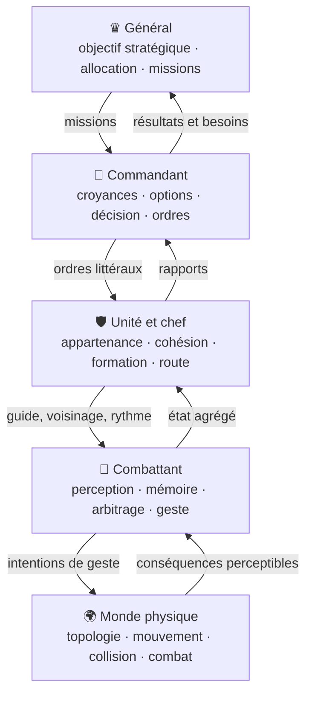

# Refactor complet du moteur de combat

## Statut

Ce document décrit la cible et l'ordre d'implémentation du refactor complet de
`/bataille`. Il ne décrit pas une nouvelle épreuve particulière : il décrit le
moteur général que les épreuves devront exercer.

Les cinq niveaux logiques sont les cinq acteurs qui peuvent réellement porter
un état et produire une action :

1. **le général** conduit l'armée ;
2. **le commandant** comprend une situation locale et donne des ordres ;
3. **l'unité et son chef de proximité** transforment un ordre en action collective ;
4. **le combattant** perçoit, interprète, choisit et agit ;
5. **le monde physique** décide de ce qui arrive effectivement.

Les ordres, la communication, la mémoire, la formation et la navigation ne
sont pas des niveaux supplémentaires : ce sont des facultés possédées ou
utilisées par ces acteurs.

---

## 1. Résultat recherché

À la fin du refactor :

- une épreuve ne déclare que le terrain, les forces, leurs appartenances, leurs
  positions initiales et leurs objectifs ;
- aucun scénario ne contient la réponse tactique qu'il est censé faire émerger ;
- un général choisit des missions à partir de ses objectifs et des informations
  disponibles ;
- un commandant entretient sa propre carte de croyances, compare plusieurs
  futurs grossiers, choisit un ordre et explique ce choix ;
- une unité connaît **ses** hommes, **son** chef, **son** ordre et **sa** forme
  courante sans posséder une grille de positions individuelles ;
- un combattant suit l'ordre qu'il a reçu, reste avec ses propres pairs, utilise
  son expérience et conserve le souvenir de ce qu'il vient de vivre ;
- les positions, vitesses, collisions, densités, passages, portes, bâtiments,
  portées et blessures appartiennent exclusivement au monde physique ;
- tout comportement significatif produit une trace lisible sur la carte et
  exportable dans une marque ;
- le navigateur et le four Node exécutent exactement la même chaîne de modules.

Le moteur doit pouvoir faire jouer sans branche dédiée :

- une bataille rangée en champ ouvert ;
- un rassemblement d'armée initialement désorganisée ;
- une marche en ville ;
- une fouille maison par maison ;
- une défense libre de choisir ses réactions ;
- des messagers cherchant une unité en mouvement ;
- de la cavalerie, des piquiers, des obstacles, du feu et un dragon.

---

## 2. Ce que l'on conserve

Le refactor ne part pas d'une page blanche.

### Noyaux à conserver

- `survival-stack/1-corps.js` à `5-qui-conduit.js` : répertoire corporel,
  réflexion, interprétation, envie et arbitrage ;
- `bataille/commandement.js` : faits, croyances, confiance, estimation, champ
  de vision et graphe tactique subjectif ;
- `bataille/faits.js` : vocabulaire des faits et portées perceptives ;
- `bataille/mesures.js` : grandeurs physiques partagées ;
- `bataille/roster.js` : composition déclarative des forces ;
- `bataille/hasard.js` : hasard déterministe ;
- les annales, les pensées, les cartes de commandant et les marques comme
  surfaces d'observation ;
- `banc-moteur.js` et son exigence d'égalité exacte pendant les extractions
  purement mécaniques.

### Façade à conserver pendant toute la migration

`window.Bataille2D` reste disponible jusqu'au dernier lot avec son API actuelle :

- cycle de vie : `poser`, `preparer`, `rejouer`, `vider`, `pas`, `etat` ;
- lecture : `troupe`, `unites`, `faits`, `chemins`, `diagnostic` ;
- ordres : `ordonnerFormation`, `ordonnerRassemblement`,
  `ordonnerDeploiement`, `deplacerDeploiement`, `ordonnerRatissage` ;
- inspection : `carteCommandant`, `rapportsCommandement`,
  `rapportsRatissage`, `sous`, `souligner` ;
- monde : `libre`, `eau`, `bornes`, `batiments`, `dangerExterieur`.

Les consommateurs existants ne migrent pas tous à la fois : la façade délègue
progressivement aux nouveaux modules.

---

## 3. Ce que l'on refuse

- Aucun `if (scenario === "C6")` dans un comportement.
- Aucun `si piques, contourner` dans la décision tactique.
- Aucun point individuel prédéfini en coordonnées mondiales pour former une armée.
- Aucun A* par combattant.
- Aucun déplacement direct de `x` et `y` depuis un ordre, une doctrine ou un scénario.
- Aucune lecture directe du camp adverse par un commandant.
- Aucun ordre reconstruit après coup depuis l'état des jambes.
- Aucun défaut universel « rester en position » quand l'objectif courant est fini.
- Aucun téléport pour entrer dans un bâtiment, rejoindre une formation ou
  rattraper un chef.
- Aucune fonctionnalité sans visualisation et sans trace de décision.
- Aucune deuxième géométrie : le dessin, la navigation et la collision lisent
  la même autorité du bâti et du terrain.

---

## 4. Architecture cible



### Arborescence proposée

```text
ecrans/modules/bataille/
  moteur/
    index.js                    façade interne de la simulation
    horloge.js                  pas fixe et calendriers de décision
    etat.js                     création et snapshot de l'état global
    chaine.js                   manifeste unique navigateur + Node

    commun/
      contrats.js               validation des objets échangés
      ordres.js                 cycle de vie d'un ordre littéral
      communications.js         messages, porteurs, livraison et échec
      faits.js                  façade sur le registre existant
      traces.js                 raisons, décisions et événements de debug

    monde/
      topologie.js              sol, bâti, eau, portes et intérieurs
      navigation.js             routes mutualisées et passages
      mouvement.js              vitesse, accélération et intégration
      collisions.js             évitement, densité, pression et cession de passage
      combat.js                 portée, orientation, coups et blessures
      dangers.js                feu, dragon et dangers non combattants

    combattant/
      perception.js             observations accessibles à cet homme
      memoire.js                ordre reçu, vécu et historique récent
      deliberation.js           adaptation de la survival stack
      gestes.js                 intentions corporelles normalisées

    unite/
      identite.js               membres, parent, chef et succession
      cohesion.js               dispersion, isolement et capacité collective
      formation.js              contraintes continues de forme
      mouvement.js              ancre, guide, rythme et intentions des membres
      rupture.js                recul, repli, rupture et ralliement

    commandant/
      memoire.js                façade/extension de commandement.js
      options.js                actions tactiques réalisables
      projection.js             futurs grossiers, risques et gains
      decision.js               choix, justification et prochain examen
      coordination.js           échanges entre pairs

    general/
      strategie.js              buts, priorités et conditions d'abandon
      conduite.js               allocation, réserves, phases et missions
```

Cette arborescence groupe le code par acteur sans prétendre qu'un acteur ne
possède qu'un fichier. Les fichiers internes séparent des responsabilités ; ils
ne créent pas de nouveaux niveaux logiques.

---

## 5. Autorité de chaque donnée

| Donnée | Écrivain unique | Lecteurs |
|---|---|---|
| Position, vitesse, orientation physique | monde | tous, sous réserve de perception |
| Collision, densité, passage libre | monde | combattant, unité, navigation |
| Vie, blessure, portée d'un coup | monde | combattant, unité, observabilité |
| Geste souhaité | combattant | monde |
| Ordre reçu par un homme | mémoire du combattant | interprétation, pensée |
| Appartenance et chef courant | unité | membres, commandants |
| Forme et cohésion | unité | membres, commandants, visualisation |
| Route de groupe | unité/navigation | chef et membres de cette unité |
| Fait observé | perception | mémoire du témoin |
| Croyance | mémoire du commandant | décision de ce commandant |
| Ordre littéral | commandant ou général | communication, destinataires |
| Mission | général/conduite | commandants concernés |
| Objectif stratégique | général | conduite et décision générale |
| Trace de décision | acteur ayant décidé | UI, marque, bancs |

Règle dure : un module peut demander une modification à l'autorité d'une
donnée, jamais la réaliser à sa place.

Exemple : une unité produit pour un membre une `IntentionMouvement`; seul le
monde applique l'accélération, les collisions et la nouvelle position.

---

## 6. Contrats de données

Tous les échanges passent par des objets validés en développement et dans les
bancs. Le JavaScript reste simple, mais chaque contrat reçoit un constructeur,
un validateur et une version.

### `Ordre`

```js
{
  id, version,
  auteurId, destinataireIds,
  donneA, recuA,
  texte,                       // la phrase réellement prononcée
  objectif: { type, cible },   // detruire | controler | empecher
  contraintes: [],
  urgence,
  expireA,
  sourceOrdreId,
  statut                       // emis | porte | recu | remplace | perime | impossible
}
```

Un ordre décrit un résultat et des contraintes ; il ne contient jamais une
liste de coordonnées individuelles.

### `Message`

```js
{
  id, ordreId,
  emetteurId, destinataireId, porteurId,
  emisA, livreA,
  dernierePositionConnue,
  contenu,
  alterations: [],
  statut                       // a_porter | en_route | cherche | livre | perdu | impossible
}
```

Le messager cherche **le destinataire ou son unité**, pas une ancienne
coordonnée. Sa dernière information peut être fausse ; il doit alors demander,
chercher un signe connu ou revenir au dernier point de rencontre.

### `Fait`

```js
{
  id, genre,
  auteurId, sujet,
  position, zone,
  observeA,
  source, apprisDe,
  confiance,
  forceMin, forceMax,
  signatures,
  texte
}
```

Un fait est ce qui a été vu, entendu, touché ou rapporté ; ce n'est jamais une
vérité globale du moteur.

### `Mission`

```js
{
  id, auteurId, executantId,
  objectif: { type, cible },
  conditionsSucces: [],
  conditionsAbandon: [],
  contraintes: [],
  priorite,
  creeeA, reviseeA,
  statut                       // active | accomplie | impossible | remplacee
}
```

Les trois objectifs initiaux sont :

- `detruire(cible)` ;
- `controler(zone)` ;
- `empecher(cible, objectif)`.

Ils ne prescrivent pas comment les atteindre.

### `IntentionGeste`

```js
{
  acteurId,
  genre,                       // marcher | tourner | attendre | frapper | parer | pousser | ceder
  direction,
  cibleId,
  allure,
  urgence,
  contraintes,
  raison,
  produitA,
  valideJusqua
}
```

### `TraceDecision`

```js
{
  acteurId, echelon,
  declencheeA,
  ordreCourant,
  objectifCourant,
  faitsUtilises: [],
  croyancesUtilisees: [],
  options: [
    { action, faisable, projection, risques, gains, score, rejets }
  ],
  choix,
  raison,
  prochainExamenA
}
```

Cette trace est l'autorité de la bulle de pensée et de l'export « à 115 s, il
aurait dû faire X ».

---

## 7. Boucle de simulation

La physique continue à battre à **20 Hz** (`dt = 0,05 s`). Les décisions lentes
ne sont pas recalculées à chaque pas.

Ordre d'un battement :

1. avancer l'horloge déterministe ;
2. actualiser l'index spatial et les conséquences encore actives ;
3. livrer les messages arrivés à portée de leur destinataire ;
4. produire les perceptions dues à ce battement ;
5. assimiler faits, souvenirs et ordres reçus ;
6. déclencher les décisions dont l'échéance fixe est atteinte ;
7. propager les ordres nouveaux dans la chaîne ;
8. mettre à jour les intentions collectives des unités ;
9. faire arbitrer chaque combattant par la survival stack ;
10. remettre les intentions de geste au monde ;
11. résoudre mouvement, collision, contact, coups, blessures et passages ;
12. émettre faits, pensées, communications et mesures ;
13. agréger l'état des unités et des commandants pour le battement suivant.

### Calendrier v0 des décisions

- combattant : à la fréquence déjà imposée par ses couches et ses stimuli ;
- unité : agrégation à 4 Hz, nouvelle route seulement si destination ou
  topologie pertinente change ;
- commandant : examen tactique toutes les **5 secondes de simulation** ;
- général : examen de conduite toutes les **15 secondes de simulation** ;
- événement critique : peut avancer le prochain examen, mais cette optimisation
  vient après la v0 fixe afin de conserver une visualisation prévisible.

Chaque acteur reçoit une phase déterministe dérivée de son identifiant afin que
tous les commandants ne décident pas dans le même battement.

---

## 8. Monde physique

Le premier lot comportemental consiste à retirer des décisions les mécanismes
qui doivent être vrais pour tout corps mobile.

### Navigation

- Un A* est calculé par **destination et groupe conducteur**, jamais par homme.
- Les unités partageant réellement origine, destination et contraintes peuvent
  partager une route mise en cache.
- Les combattants suivent localement leur guide et la portion visible de la
  route ; ils ne connaissent pas le graphe de la ville.
- Une route est invalidée par un changement de destination, une porte devenue
  infranchissable ou un obstacle durable, pas par un léger écart individuel.
- Entre deux quartiers, le même contrat choisit successivement grands axes,
  portes, rues et approche locale ; il ne connaît aucune épreuve.

### Mouvement et vitesse dynamique

La vitesse souhaitée d'un membre est la somme bornée de contraintes continues :

- progression vers le guide ou la route ;
- rattrapage de son unité propre ;
- maintien de ses voisins ;
- écartement d'une collision ;
- disponibilité physique et souffle ;
- menace immédiate ;
- ordre d'attendre, de tenir ou de rompre.

Le guide adapte son allure à la cohésion :

- il ralentit lorsque le P90 des distances au groupe augmente ;
- il attend lorsque le groupe est réellement rompu ;
- il accélère progressivement lorsque le groupe est reformé ;
- il n'attend pas les morts, blessés, prisonniers ou hommes explicitement
  détachés.

Cela remplace le chef qui marche seul en avant sans immobiliser artificiellement
les suivants.

### Cession de passage

- Un acteur presque immobile reçoit une petite impulsion latérale lorsqu'il
  bloque un allié engagé dans un déplacement cohérent.
- Cette cession est plus forte pour un chef ou un messager en mouvement.
- Elle dépend de la vitesse relative, de l'espace libre et de la masse locale,
  jamais du scénario ni du nom du rôle.
- À haute densité, l'impulsion ne crée pas de place : la pression et le risque
  de chute augmentent à la place.

### Densité et pression

- La densité locale est une mesure du monde.
- Entre 2 et 3 personnes/m², la vitesse volontaire commence à diminuer.
- Entre 4 et 5 personnes/m², les contacts involontaires dominent.
- À partir de 5 à 6 personnes/m², le mouvement volontaire et la capacité de
  recul peuvent disparaître.
- Une chute dans une masse dense crée un déficit de support et un risque de
  chute en chaîne.

Le moteur ne code donc pas « l'unité panique parce qu'elle est serrée » : il
retire physiquement ses issues, et les couches corporelles réagissent à cette
conséquence.

### Bâtiments

- Une porte est un passage topologique avec largeur, capacité et état.
- Entrer signifie franchir le seuil au fil des pas, jamais assigner une position
  intérieure.
- L'intérieur appartient au même graphe topologique que la rue, avec une
  capacité et des sorties connues ou inconnues.
- Une équipe de fouille sait combien des siens sont entrés et ressortis ; la
  mission décide quand poursuivre vers une autre maison.
- Un blocage au seuil est visible comme file, densité et absence de progression.

### Combat

- Une attaque exige portée, orientation, capacité des bras et cible accessible.
- Fermer les derniers mètres est un mouvement physique ; aucun combattant ne
  s'arrête à 5–10 m parce que l'état `engager` a été atteint.
- La portée de l'arme détermine quels rangs peuvent frapper.
- La presse derrière ne donne pas un bonus abstrait : elle retire du jeu,
  gêne les armes et peut empêcher le recul.
- Le combat produit des micro-pulses d'entrée et de sortie de mesure ; les
  accalmies longues doivent émerger de la fatigue, de la peur et de la perte
  des meneurs.

---

## 9. Combattant

### État minimal

Chaque combattant possède :

- son identité et son camp ;
- `uniteId`, `chefConnuId` et la dernière position où il a vu ce chef ;
- son ordre reçu, sa date et son interprétation ;
- son expérience acquise avant la bataille ;
- un historique récent borné de perceptions et d'actions ;
- l'état des cinq couches de la survival stack ;
- sa pensée courante : action, raison, système conducteur et alternative battue.

### Appartenance

Le combattant ne cherche pas « des alliés » mais, par ordre :

1. ses voisins connus de la même unité ;
2. son chef de proximité ou son successeur reconnu ;
3. le signe de son unité ;
4. un supérieur connu capable de le réaffecter ;
5. seulement dans un cas de rupture prolongée, un groupe allié quelconque.

Rejoindre n'importe quel point de même couleur n'est donc jamais le défaut.

### Mémoire individuelle

La mémoire conserve des épisodes simples et généraux :

- ordre reçu et dernière confirmation ;
- chef vu vivant, tombé ou perdu ;
- unité rejointe ou perdue ;
- ennemi vu à un lieu et une heure ;
- engagement gagné, perdu ou interrompu ;
- repli, blessure, encerclement ou issue trouvée ;
- action tentée et conséquence corporelle.

Le vécu accumulé modifie l'habituation et les acquis existants ; il ne devient
pas une liste de règles tactiques spécialisées.

### Arbitrage

La survival stack demeure l'unique arbitre des jambes et des bras :

- le corps propose selon les stimuli et les gestes acquis ;
- la réflexion cherche une issue ;
- l'interprétation mesure la prise de l'ordre ;
- l'envie produit ses prétentions ;
- `QuiConduit` élit séparément jambes et bras ;
- la sortie devient une `IntentionGeste` remise au monde.

---

## 10. Unité et chef de proximité

### L'unité comme acteur collectif

Une unité possède :

- une identité stable et un parent ;
- ses membres, jamais déduits d'une proximité fortuite ;
- son chef courant et l'état de sa succession ;
- son ordre collectif et sa mission ;
- son ancre, son front et sa profondeur courante ;
- sa route partagée ;
- sa cohésion, sa dispersion, sa fatigue et sa capacité de combat ;
- ses détachements explicites : messager, éclaireur, fouille, liaison.

### Formation sans grille

Une formation est un ensemble de contraintes :

- orientation commune ;
- largeur et profondeur désirées ;
- distance de voisinage ;
- densité maximale ;
- ordre relatif souple entre sous-groupes ;
- continuité avec le chef et la route ;
- adaptation à la largeur réellement disponible.

Chaque homme reçoit une région ou une relation, jamais un slot mondial.

Dans un champ, ces contraintes peuvent produire une ligne irrégulière ; dans
une rue, la même unité prend de la profondeur ; à un carrefour, elle se déforme
puis se reforme.

### Chef mobile et repos de la troupe

- Une unité en marche suit son chef et son ordre collectif.
- Lorsqu'elle a rejoint la force supérieure et reçu `repos`, elle tient son
  secteur sans suivre chaque déplacement social de son chef.
- Le chef peut alors rejoindre le point de commandement, communiquer et revenir.
- `repos` ne se déclenche qu'après la preuve de ralliement : membres présents,
  cohésion suffisante et place collective atteinte.
- Un nouvel ordre collectif réattache immédiatement l'unité à son guide.

### Rupture

La rupture combine :

- pertes et fatigue ;
- disparition du chef ou du signe ;
- menace perçue ;
- capacité de riposte estimée ;
- espace disponible derrière ;
- cohésion déjà perdue ;
- expérience et préparation.

Elle est discontinue, mais sa préparation est continue. Le recul en ordre, la
rupture et la déroute restent trois états distincts.

---

## 11. Ordres et communication

### Ordres

Les verbes restent peu nombreux ; la précision vient des compléments :

- avancer ;
- tenir ;
- se replier ;
- suivre ;
- appuyer.

Les missions `détruire`, `contrôler` et `empêcher` sont au-dessus de cette
grammaire : elles peuvent produire plusieurs ordres successifs.

Une bulle d'ordre affiche exactement `ordre.texte`, uniquement pendant la
fenêtre où l'ordre est réellement prononcé ou répété.

### Communication verticale

- Le général adresse une mission à un commandant.
- Le commandant produit un ordre littéral pour une unité ou un subordonné.
- Le canal choisit signal préconvenu, voix, messager ou contact direct.
- Le destinataire accuse réception par parole, signe ou comportement visible.
- Une livraison échouée reste un fait : le porteur ne trouve plus l'unité, le
  chef est mort, le passage est fermé ou le temps est dépassé.

### Communication entre pairs

Deux commandants de même rang échangent lorsque :

- ils se rencontrent à portée de parole ;
- leurs zones ou objectifs se chevauchent ;
- l'un possède un fait utile à l'autre ;
- leurs ordres paraissent incompatibles ;
- l'un demande explicitement l'ordre courant de l'autre.

Le contenu peut être :

- « je prends cette rue » ;
- « rien trouvé dans cette zone à telle heure » ;
- « nous avons vaincu ou fui tel groupe » ;
- « j'estime tant d'ennemis ici » ;
- « mon ordre est X ; quel est le vôtre ? ».

L'effet n'est pas une conversation décorative : les faits sont transmis, les
engagements mutuels sont enregistrés et une mission peut être réallouée.

### Messager comme banc de vérité

Une épreuve de messager doit vérifier :

1. départ du porteur avec une copie de l'ordre ;
2. route vers la dernière position ou le dernier signe connu ;
3. recherche locale si l'unité a bougé ;
4. identification de **la bonne unité** ;
5. remise au chef vivant ou à son successeur ;
6. accusé de réception ;
7. retour vers l'émetteur, lui aussi mobile ;
8. compte rendu d'échec si l'un des deux ne peut être retrouvé.

---

## 12. Commandant

### Carte de croyances

Chaque commandant possède sa carte, à son échelle :

- positions amies connues ;
- positions ennemies possibles ;
- intervalles d'effectifs ;
- signatures observables : montés, longues hampes, feu, barricade ;
- âge, source et confiance ;
- zones explicitement inconnues ;
- ordres et engagements avec les pairs ;
- historique des combats et replis observés ou rapportés.

La carte ne se met à jour que par vision, audition, trace, rapport ou
raisonnement explicitement enregistré.

### Bibliothèque minimale d'actions tactiques

La v0 n'essaie pas de connaître les doctrines historiques. Elle énumère des
actions générales rendues possibles par l'état courant :

- progresser vers l'objectif ;
- chercher dans une zone inconnue ;
- engager un ennemi connu ;
- fermer ou ouvrir la distance ;
- changer d'axe praticable ;
- rallier une force amie ;
- tenir ou occuper une zone utile ;
- rompre le contact ;
- demander, transmettre ou attendre une information ;
- garder ou engager une partie de la force disponible.

« Contourner des piquiers » n'est pas une action spéciale : si l'approche
frontale projette beaucoup de pertes et qu'un autre axe praticable progresse
encore vers l'objectif, `changer d'axe` obtient un meilleur score.

### Projection v0

Chaque option est projetée sur un horizon grossier de 20 à 60 secondes avec :

- distance et temps d'approche ;
- exposition estimée ;
- rapport de force incertain ;
- cohésion probable à l'arrivée ;
- capacité à rompre ou recevoir du soutien ;
- progression vers l'objectif ;
- contrôle du lieu ;
- risque de pertes, d'isolement et de désorganisation ;
- valeur de l'information gagnée ;
- inconnues qui rendent la projection fragile.

On ne resimule pas chaque homme dans la tête du commandant : on projette des
agrégats issus de **ses** croyances.

### Fonction de valeur

Le score combine des termes déclarés par la mission :

```text
score = progrès vers l'objectif
      + contrôle utile
      + destruction probable de la cible
      + information gagnée
      - pertes propres probables
      - risque de rupture
      - isolement
      - temps consommé
      - violation des contraintes reçues
```

Les poids viennent de la mission, de la personnalité et de l'expérience ; ils
ne viennent jamais du type d'ennemi ou du nom du scénario.

### Boucle après péremption

Un commandant n'attend jamais sans raison lorsque son ordre principal est fini :

- `détruire` devient rechercher les ennemis plausibles, les engager, confirmer
  leur destruction ou rallier un ami mieux informé ;
- `contrôler` devient atteindre la zone, la rendre praticable, surveiller les
  approches, répondre aux menaces puis reprendre le contrôle ;
- `empêcher` devient suivre la menace vers son objectif probable, interposer la
  force, retarder, combattre puis réévaluer.

`tenir` n'est choisi que si une zone ou une contrainte lui donne une utilité.

---

## 13. Général

Le général n'est pas un commandant avec un rayon plus grand.

### État stratégique

Il possède :

- un ou plusieurs objectifs finaux pondérés ;
- les pertes acceptables ;
- le temps disponible ;
- les zones dont la possession compte ;
- les forces connues, engagées, disponibles ou perdues ;
- les rapports reçus, avec leur retard et leur confiance ;
- les réserves et les messagers encore utilisables.

### Actions

- créer, modifier ou annuler une mission ;
- répartir les forces entre missions ;
- garder, déplacer ou engager une réserve ;
- demander une reconnaissance ou un rapport ;
- changer une priorité ;
- constater qu'un objectif est devenu impossible ;
- décider d'une retraite générale ou d'une poursuite.

### Intelligence attendue

Le général est jugé sur sa capacité à :

- conserver une force non engagée lorsque l'incertitude le justifie ;
- détecter un axe qui s'effondre à partir de rapports imparfaits ;
- ne pas envoyer successivement toutes ses unités dans le même bouchon ;
- exploiter une brèche sans détruire sa propre cohésion ;
- protéger son objectif final plutôt que poursuivre chaque ennemi visible ;
- réviser une mission devenue obsolète.

La v0 peut commencer avec `foncer dans le tas` comme unique ordre d'engagement,
à condition que le choix de la mission, de l'axe, de la force engagée et du
moment soit déjà explicite et observable.

---

## 14. Observabilité obligatoire

L'observabilité n'est pas le dernier lot : chaque extraction doit livrer sa
visualisation dans le même commit.

### Sur la carte

- chef : bulle de l'ordre littéral seulement lorsqu'il le dit ;
- combattant : au survol, « j'essaie de X parce que Y » ;
- unité sélectionnée : ancre, front, profondeur, voisins structurants, route
  partagée, cohésion et allure du guide ;
- commandant sélectionné : champ de vision, croyances, intervalles d'effectifs,
  confiance, graphe tactique, option choisie et alternatives ;
- monde : obstacles, portes, routes, densité, collisions, points bloqués et
  transitions intérieur/extérieur ;
- communication : porteur, émetteur, destinataire recherché, contenu et statut.

### Dans les marques

Une marque contient :

- commentaire du joueur ;
- capture de la zone courante ;
- temps de bataille et URL d'épreuve ;
- état physique et appartenance du sujet ;
- ordre courant et historique des ordres ;
- perceptions récentes, en conservant prioritairement la fin ;
- mémoire et croyances si le sujet commande ;
- dernière `TraceDecision` et prochain examen ;
- état de l'unité et distances au chef ;
- route, collisions, densité et obstacles proches ;
- événements et communications récents.

### Journal de décision

Le panneau de debug permet de filtrer :

- par acteur ;
- par seconde de simulation ;
- par mission ou ordre ;
- par option choisie ou rejetée ;
- par changement de croyance ;
- par livraison ou échec de message.

Une capture exportée à 115 secondes doit permettre de répondre sans rejouer :
« que croyait-il, quelles options a-t-il envisagées, pourquoi a-t-il choisi
celle-ci et quand devait-il réexaminer ? ».

---

## 15. Migration des fonctions existantes

| Fonction actuelle | Destination cible |
|---|---|
| `preparer`, `terrainEpreuve`, `libre`, `eau`, `bornes`, `batiments` | `moteur/monde/topologie.js` |
| routes internes, `chemins` | `moteur/monde/navigation.js` |
| intégration des positions, poussée, passage | `moteur/monde/mouvement.js` + `collisions.js` |
| portée, orientation, coups, blessures | `moteur/monde/combat.js` |
| `dangerExterieur`, incendies | `moteur/monde/dangers.js` |
| adaptation de `Corps` et `Reflexion` | `moteur/combattant/deliberation.js` |
| perceptions et historique individuel | `moteur/combattant/perception.js` + `memoire.js` |
| `ordonnerFormation`, intentions locales | `moteur/unite/mouvement.js` |
| `ordonnerRassemblement`, `ordonnerDeploiement`, `deplacerDeploiement` | `moteur/unite/formation.js` |
| `unites`, guide, succession, appartenance | `moteur/unite/identite.js` + `cohesion.js` |
| `jugerRuptureUnite` | `moteur/unite/rupture.js` |
| `commandement.js`, `carteCommandant` | `moteur/commandant/memoire.js` |
| `ordonnerRatissage`, rapports et échanges de secteurs | missions + `commandant/coordination.js` |
| ordres littéraux et doctrines | `moteur/commun/ordres.js` |
| coureurs, transmission, retours | `moteur/commun/communications.js` |
| annales, pensées, décisions | `moteur/commun/traces.js` |
| futur choix tactique | `commandant/options.js`, `projection.js`, `decision.js` |
| futur plan d'armée | `general/strategie.js`, `general/conduite.js` |
| `pas`, `etat`, `rejouer`, `vider` | `moteur/index.js`, masqués par la façade `Bataille2D` |

---

## 16. Ordre d'implémentation

### Lot 0 — Geler ce que l'on sait mesurer

- [x] Lancer et archiver le verdict actuel de `banc-moteur.js`.
      *(26 août : l'étalon du 24 était périmé — 7 fichiers de la chaîne avaient changé
      depuis. Reposé sur l'état du jour ; verdict et relevé à 220 s archivés dans
      `analyse/refactor-moteur/`. Ce relevé dit que le fer ne se touche plus :
      0 mort, porte arrêtée à 900 pv, aucun contact. Défaut antérieur au
      refactor, du ressort des lots 2 et 3.)*
- [ ] Ajouter les métriques qui manquent avant de déplacer le code :
  téléports, collisions, densité, A* calculés, distance P90 au chef, combattants
  arrêtés hors portée, décisions et communications.
- [ ] Relever C5, C6, le ratissage, le messager et l'entrée de bâtiment.
- [ ] Définir pour chaque épreuve ce qui doit rester identique pendant une
  extraction et ce qui est précisément destiné à changer.
- [ ] Vérifier dans le navigateur la carte, le bâti visible et le masque de
  collision avant toute comparaison.

**Sortie :** un dossier de référence reproductible et des marques utilisables.

### Lot 1 — Contrats, manifeste et façade

- [x] Créer `moteur/commun/contrats.js` et les validateurs.
- [x] Créer `moteur/commun/traces.js`.
- [x] Créer un manifeste unique `moteur/chaine.js` consommé par `/bataille`, le
  four et les bancs.
      *(Consommé aussi par `jeu.html` — en balises, vérifiées par le manifeste — et
      par `scripts/monde/corps_mesure.js`. Les listes de `analyse/` restent figées :
      ce sont des relevés archivés, leur chaîne est leur condition. Deux divergences
      réelles corrigées au passage : `roster.js` manquait à `jeu.html` alors que
      `bataille2d.js` le lit, et `5-qui-conduit.js` y venait après son pourvoyeur
      au lieu d'avant.)*
- [x] Créer `moteur/index.js` derrière l'API actuelle de `Bataille2D`.
      *(Délégation par `Proxy`, pour ne pas tenir une liste de plus. Elle branche
      l'horloge des traces sur `etat().temps` — le seul service réel à ce stade.)*
- [ ] Faire passer l'état global par un objet de simulation explicite au lieu
  de variables libres, sans changer le comportement.
      *(Non fait, et c'est le seul point du lot 1 qui reste. Une cinquantaine de
      variables libres mutables dans `bataille2d.js`, dont plusieurs portent un nom
      que des portées locales reprennent : `reste` (130 usages, 4 déclarations),
      `verrou` (68 / 6), `roi` (55 / 3), `plan` (68 / 3). Un renommage en masse
      passerait l'étalon en cassant des chemins que le banc n'exerce pas — le
      rendu, notamment. À faire variable par variable, dans son propre commit.)*

**Validation :** étalon moteur strictement identique, chargement navigateur et
Node identique, aucune nouvelle branche de scénario.

### Lot 2 — Extraire le monde physique

- [ ] Extraire topologie, navigation, mouvement, collisions et combat.
- [ ] Interdire les écritures de position hors du monde par garde de développement.
- [ ] Unifier dessin, bâti, eau, portes, intérieurs et masque de navigation.
- [ ] Instrumenter les déplacements supérieurs à la vitesse physiquement possible.
- [ ] Implémenter cession de passage et densité comme physique commune.
- [ ] Remplacer les entrées de bâtiment par des transitions topologiques.

**Validation :** zéro divergence d'étalon pour l'extraction ; puis épreuves
ciblées sans téléport, sans traversée de mur et sans bouchon artificiel au seuil.

### Lot 3 — Stabiliser le combattant

- [ ] Introduire `IntentionGeste` comme unique sortie individuelle.
- [ ] Faire passer corps, réflexion, interprétation et envie par un adaptateur unique.
- [ ] Donner à chaque homme ordre reçu, chef connu, unité et mémoire récente.
- [ ] Éliminer les branches de mouvement qui contournent `QuiConduit`.
- [ ] Brancher la pensée courante sur la vraie trace d'arbitrage.

**Validation :** aucun assaut solo sans cause observable ; contact réellement
fermé jusqu'à la portée ; réaction différente selon vécu, fatigue, ordre et issue.

### Lot 4 — Extraire unité, cohésion et formation

- [ ] Créer l'identité d'unité stable et la succession de chef.
- [ ] Remplacer les slots par contraintes continues.
- [ ] Mutualiser navigation par guide et destination.
- [ ] Ajouter vitesse dynamique du guide et rattrapage des membres.
- [ ] Implémenter `repos` après ralliement effectif.
- [ ] Faire des détachements des états explicites, pas des ruptures d'appartenance.

**Validation :** C5 forme une armée imparfaite mais lisible ; aucune boule
autour du chef ; aucune arrière-cour choisie pour compléter un damier ; les
chefs prennent des places cohérentes avec les unités.

### Lot 5 — Ordres et communications communs

- [ ] Créer le cycle de vie de `Ordre`.
- [ ] Créer `Message` et le comportement général de porteur.
- [ ] Migrer bannière, voix, coureurs et accusés de réception.
- [ ] Faire chercher l'identité mobile du destinataire.
- [ ] Ajouter communication entre pairs et transmission de faits.
- [ ] Afficher uniquement la phrase réellement dite.

**Validation :** épreuve complète du messager, y compris retour ; aucune
livraison à une ancienne coordonnée ; un ordre perdu ou déformé reste expliqué.

### Lot 6 — Commandant décisionnaire

- [ ] Étendre la mémoire existante avec zones inconnues et historique de vécu.
- [ ] Énumérer les actions tactiques réalisables depuis les affordances.
- [ ] Implémenter projection, fonction de valeur et décision fixe toutes les 5 s.
- [ ] Produire `TraceDecision` complète.
- [ ] Implémenter les boucles `détruire`, `contrôler`, `empêcher`.
- [ ] Migrer le ratissage comme mission ordinaire utilisant bâtiments,
  communications et croyances.

**Validation :** C6 sans doctrine spécifique, ratissage non railroadé, défense
capable de choisir, décisions inspectables seconde par seconde.

### Lot 7 — Général et conduite de l'armée

- [ ] Créer objectifs stratégiques, missions et conditions d'abandon.
- [ ] Créer allocation des forces et réserve.
- [ ] Faire remonter rapports, pertes, demandes et incertitudes.
- [ ] Déclencher la révision générale toutes les 15 s.
- [ ] Permettre changement de mission sans télécommander les hommes.

**Validation :** deux forces en champ ouvert peuvent produire des plans
différents à partir des mêmes facultés ; le résultat n'est pas inscrit dans
l'épreuve ; le général sait préserver une réserve et réagir à un axe perdu.

### Lot 8 — Supprimer le monolithe

- [ ] Déplacer le rendu restant dans les modules de page.
- [ ] Réduire `bataille2d.js` à une façade de compatibilité.
- [ ] Migrer tous les consommateurs vers `moteur/index.js`.
- [ ] Supprimer la façade lorsque navigateur, four, bancs et scripts ne la lisent plus.
- [ ] Retirer les fonctions mortes et les anciens chemins de décision.
- [ ] Mettre à jour l'architecture locale et ce document avec les modules réels.

**Validation :** aucune logique de simulation dans la page, aucune liste de
scripts dupliquée, aucune fonction cible encore enfouie dans un fichier géant.

---

## 17. Bancs obligatoires

### P0 — Physique et circulation

- deux alliés se croisent dans une rue étroite ;
- un immobile cède légèrement, davantage devant un chef ou un messager ;
- une foule trop dense ne fabrique pas magiquement de l'espace ;
- aucun déplacement ne dépasse la limite sans événement d'initialisation déclaré.

### M1 — Messager et unité mobile

- le destinataire quitte son ancienne position ;
- le porteur suit les indices, trouve la bonne unité, remet l'ordre et revient ;
- variante : chef mort, successeur ;
- variante : unité rompue, livraison impossible et retour d'échec.

### O1 — Organisation d'armée

- l'armée commence dispersée ;
- chacun cherche ses pairs et son chef ;
- les chefs rejoignent leurs supérieurs ;
- les unités se déploient selon le terrain sans grille mondiale ;
- `repos` ne commence qu'après le ralliement de la troupe.

### V1 — Fouille de ville

- plusieurs unités reçoivent une zone et se répartissent par communication ;
- les probabilités de présence rebelle dépendent seulement des bâtiments ;
- les hommes franchissent les portes physiquement ;
- une maison terminée conduit à la suivante ;
- un groupe contient un chef identifiable ;
- cette information remonte par la chaîne ;
- les défenseurs peuvent bouger, se cacher, fuir, se regrouper ou contre-attaquer.

### C6 — Bataille rangée ouverte

- infanterie, piquiers et cavalerie des deux côtés ;
- information initiale incomplète ;
- aucune réponse tactique liée au type d'unité ;
- la ligne de front est mesurée, jamais dessinée à l'avance ;
- les unités ferment réellement le contact ;
- les micro-pulses, reculs, soutiens, réserves et ruptures sont observables ;
- les pertes après rupture doivent devenir plus asymétriques que pendant le face-à-face.

### D1 — Danger extérieur

- le dragon et le feu passent par `dangerExterieur` ;
- l'ombre, le rugissement, la chaleur et les dégâts restent séparés ;
- les commandants ne connaissent que ce qu'ils voient ou apprennent ;
- la doctrine éventuelle modifie les contraintes générales, pas une branche D1.

---

## 18. Métriques de réussite

### Monde

- nombre de téléports non autorisés : **0** ;
- intersections avec le bâti : **0** ;
- cellules de bâtiment visible déclarées libres par le masque : **0** ;
- A* par homme : **0** ;
- routes recalculées par unité et par minute ;
- densité maximale et durée au-dessus de chaque seuil.

### Combattants et unités

- distance médiane et P90 au chef ;
- part des hommes avec au moins un pair propre à 12 m ;
- part des hommes arrêtés à 5–10 m d'un ennemi sans raison physique ;
- part réellement engagée par rang et par arme ;
- durée des épisodes dans et hors de mesure ;
- cohésion avant, pendant et après un passage étroit ;
- nombre d'assauts individuels sans ordre, soutien ou emprise corporelle forte.

### Commandement

- ordres émis, reçus, perdus, déformés, remplacés et périmés ;
- délai de transmission et distance réellement parcourue ;
- faits vus contre faits rapportés ;
- confiance moyenne selon l'âge ;
- décisions prises et réexamens manqués ;
- options faisables, rejetées et raisons de rejet ;
- missions sans prochaine action : **0**, sauf impossibilité explicitement tracée.

### Bataille

- position, largeur et irrégularité du front ;
- part d'unités en réserve hors tension immédiate ;
- recul cumulé par micro-pulses ;
- durée des accalmies émergentes ;
- pertes avant et après rupture ;
- blessures de face, de flanc, de dos et sur homme déjà hors de combat ;
- captures et redditions lorsque les statuts sociaux les rendent possibles.

---

## 19. Discipline de livraison

Chaque lot suit la même séquence :

1. relever le comportement et les métriques avant modification ;
2. écrire ou renforcer le banc qui rend le défaut visible ;
3. extraire derrière la façade sans changement comportemental ;
4. obtenir l'égalité exacte de l'étalon ;
5. introduire le changement de modèle ;
6. vérifier les bancs ciblés ;
7. vérifier `/bataille` dans le navigateur, console comprise ;
8. produire une marque ou capture lisible ;
9. mettre à jour le diagramme des modules réellement existants ;
10. committer uniquement les fichiers du lot.

Un étalon ne doit être reposé que si le changement de comportement est voulu,
mesuré, expliqué dans le commit et accompagné d'un nouveau critère de réussite.

---

## 20. Définition de « terminé »

Le refactor complet est terminé lorsque :

- `bataille2d.js` n'est plus propriétaire d'aucune règle de simulation ;
- chaque donnée a un écrivain unique ;
- les cinq acteurs possèdent un état, des entrées, des actions et des traces
  clairement identifiables ;
- une épreuve ne contient plus de comportement caché ;
- la navigation, la collision et le bâti forment une seule géométrie ;
- les unités se forment sans slots et suivent leur propre chaîne ;
- les commandants décident depuis leurs croyances et non depuis la vérité globale ;
- les généraux allouent missions et réserves ;
- ordres et messages peuvent réussir, échouer et être inspectés ;
- toute action importante répond à « j'essaie de X parce que Y » ;
- une marque suffit pour diagnostiquer une mauvaise décision à une seconde donnée ;
- navigateur, four et bancs chargent le même manifeste ;
- C5, M1, V1, C6 et D1 passent leurs critères sans branche spécialisée.

À ce point, ajouter une nouvelle bataille signifie déclarer un terrain, des
forces et des objectifs — pas écrire une nouvelle intelligence.
