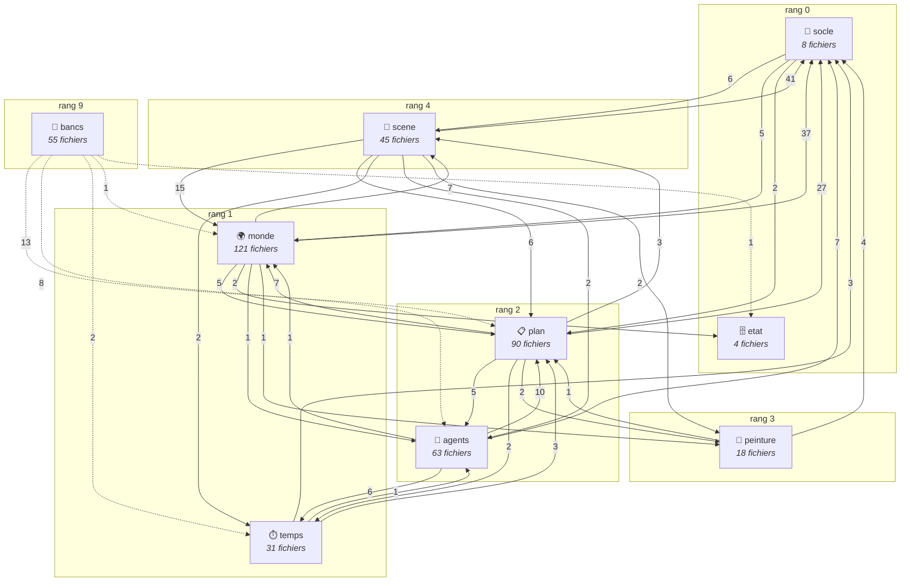

# Le graphe d'architecture — **généré**, jamais écrit à la main

> Produit par `python scripts/analyse/graphe_archi.py --doc` en lisant les
> imports Python, les `require` Node et les globales du navigateur, projetés
> sur la déclaration de [`containers.json`](containers.json). **Ne pas éditer :**
> toute correction se fait dans la déclaration ou dans le code, et l'on régénère.

Les intentions et les lois sont dans [`organisation.md`](organisation.md) ;
les boucles du jeu dans [`architecture.md`](architecture.md).

## Les containers et leurs liens

## Le tableau des liens

| de | vers | références | |
|---|---|---:|---|
| `scene` | `socle` | 41 |  |
| `monde` | `socle` | 37 |  |
| `plan` | `socle` | 27 |  |
| `scene` | `monde` | 15 |  |
| `bancs` | `plan` | 13 |  |
| `agents` | `plan` | 10 | ⚠️ remontée |
| `bancs` | `agents` | 8 |  |
| `agents` | `socle` | 7 |  |
| `plan` | `monde` | 7 |  |
| `monde` | `scene` | 7 | ⚠️ remontée |
| `agents` | `temps` | 6 |  |
| `scene` | `plan` | 6 |  |
| `socle` | `scene` | 6 | ⚠️ remontée |
| `monde` | `plan` | 5 | ⚠️ remontée |
| `plan` | `agents` | 5 | ⚠️ remontée |
| `socle` | `monde` | 5 | ⚠️ remontée |
| `peinture` | `socle` | 4 |  |
| `temps` | `plan` | 3 | ⚠️ remontée |
| `temps` | `socle` | 3 |  |
| `plan` | `scene` | 3 | ⚠️ remontée |
| `monde` | `etat` | 2 |  |
| `plan` | `temps` | 2 |  |
| `scene` | `temps` | 2 |  |
| `scene` | `agents` | 2 |  |
| `bancs` | `temps` | 2 |  |
| `plan` | `peinture` | 2 | ⚠️ remontée |
| `scene` | `peinture` | 2 |  |
| `socle` | `plan` | 2 | ⚠️ remontée |
| `agents` | `monde` | 1 |  |
| `bancs` | `monde` | 1 |  |
| `peinture` | `plan` | 1 |  |
| `monde` | `agents` | 1 | ⚠️ remontée |
| `temps` | `agents` | 1 | ⚠️ remontée |
| `bancs` | `etat` | 1 |  |
| `monde` | `peinture` | 1 | ⚠️ remontée |

## Les modules, par container

### 🗄️ etat — rang 0

*La seule verite : un fait qui n'y est pas ecrit n'existe pas*

**4 fichiers, 415 lignes.** Porte : `scripts/etat/expose.py`

- **scripts/** (4) — `tables.py`, `ajouter.py`, `purger.py`, `veille.py`

### 🔩 socle — rang 0

*Ce qui n'a pas de sujet et que tout le monde traverse : le transport, les chemins, le siege, la messagerie des ecrans*

**8 fichiers, 1730 lignes.** Porte : `serveur/http.js`

- **serveur/** (4) — `siege.js`, `contexte.js`, `dates.js`, `http.js`
- **ecrans/** (4) — `bus.js`, `nav.js`, `entites.js`, `loupe.js`

### 🌍 monde — rang 1

*La ville : masque, plan, bati, gens, relief — sa cuisson, son service et son ecran*

**121 fichiers, 42045 lignes.** Porte : `scripts/monde/expose.py` · `serveur/monde/index.js`

- **scripts/** (75) — `plan_ville.py`, `peyredragon_interieurs.py`, `densifier.py`, `peupler.py`, `formes.py`, `coudre.py`, `peyredragon.py`, `besoins.py`, `programme.py` … et 66 autres
- **serveur/** (10) — `monde3d.js`, `marche.js`, `carte.js`, `presence.js`, `monde-jeu.js`, `terrain.js`, `foule.js`, `chemin.js`, `marche.js` … et 1 autres
- **ecrans/** (36) — `carte-ville.js`, `plan.js`, `foule2d.js`, `plans.js`, `carte.js`, `journee.js`, `gens.js`, `terrain.js`, `ville3d.js` … et 27 autres

### ⏱️ temps — rang 1

*Possede le temps hors-scene : horloges, echeances, diffusion — calcule et propose, ne decide jamais*

**31 fichiers, 6862 lignes.** Porte : `scripts/temps/expose.py` · `serveur/temps/index.js`

- **scripts/** (29) — `presence.py`, `occupation.py`, `fenetre.py`, `ecrits.py`, `disponibilite_regie.py`, `plan.py`, `presence_quartier.py`, `disponibilite.py`, `rumeur.py` … et 20 autres
- **serveur/** (2) — `calendrier.js`, `index.js`

### 🧠 agents — rang 2

*LES SIEGES, humains comme PNJ : servir un point de vue, recevoir des actes, tenir un fil (le vecu), tenir un brouillard — deux profils (scene / journee), une machinerie*

**63 fichiers, 14535 lignes.** Porte : `scripts/agents/expose.py` · `serveur/agents/index.js`

- **scripts/** (58) — `runtime.py`, `cycle.py`, `mission.py`, `mj.py`, `activite.py`, `brief.py`, `chambre.py`, `parloir.py`, `graphe.py` … et 49 autres
- **serveur/** (5) — `regie.js`, `activations.js`, `chambre-livres.js`, `fil-homme.js`, `index.js`

### 📋 plan — rang 2

*Le Grand Plan : cahiers, couverture, criticite, levees — ce que les hommes ecrivent et ce qu'on en tire*

**90 fichiers, 21009 lignes.** Porte : `scripts/plan/expose.py` · `serveur/plan/index.js`

- **scripts/** (61) — `normaliser_etats.py`, `scinder_moyens.py`, `cens.py`, `tissage.py`, `missions.py`, `plan_leves.py`, `sections.py`, `corriger_plan.py`, `graphe_causal.py` … et 52 autres
- **serveur/** (7) — `echiquier.js`, `bibliotheque.js`, `atelier.js`, `agenda.js`, `livres.js`, `index.js`, `echiquier.js`
- **ecrans/** (22) — `echiquier.js`, `jetons.js`, `renvois.js`, `volume.js`, `coffret.js`, `marques.js`, `etagere.js`, `portee.js`, `renvois.js` … et 13 autres

### 🎨 peinture — rang 3

*Ce qui appelle une API payante : portraits, salles, voix, chansons*

**18 fichiers, 2814 lignes.** Porte : `scripts/peinture/expose.py` · `serveur/peinture/index.js`

- **scripts/** (13) — `gen_voix.py`, `figures.py`, `nappe.py`, `gen_salles.py`, `generer_chanson.py`, `figure_forces.py`, `medaillons.py`, `importer_portraits_serenissima.py`, `audition_voix.py` … et 4 autres
- **serveur/** (5) — `voix.js`, `medias.js`, `portraits.js`, `voix.js`, `index.js`

### 📜 scene — rang 4

*LE RENDU du profil scene : le flux, l'inbox, la montre, la mise en scene — ce que le joueur voit ; personne ne la lit*

**45 fichiers, 8459 lignes.** Porte : `scripts/scene/expose.py` · `serveur/scene/index.js`

- **scripts/** (12) — `flux.py`, `flux_ecrits.py`, `flux_scribe.py`, `tunnel.py`, `regie.py`, `flux_transport.py`, `seed_flux.py`, `expose.py`, `regie.py` … et 3 autres
- **serveur/** (8) — `action.js`, `fils.js`, `piece.js`, `joueur.js`, `scene.js`, `serveur.js`, `verbe.js`, `index.js`
- **ecrans/** (25) — `son.js`, `nappe.js`, `calendrier.js`, `illustration.js`, `actions.js`, `galerie.js`, `voix.js`, `regie.js`, `visage.js` … et 16 autres

### 🔬 bancs — rang 9

*Ils lisent tout et n'ecrivent rien : gardes, mesures, etalons, audit*

**55 fichiers, 9113 lignes.** Porte : `scripts/verifier.mjs`

- **scripts/** (51) — `croisement.py`, `parvenir.py`, `exporter_aurore.py`, `graphe_archi.py`, `test_depeche_contextes.py`, `verifier.mjs`, `essai_occupation.py`, `test_activation_lieu.py`, `mesurer.py` … et 42 autres
- **serveur/** (4) — `test_siege.js`, `test_marche.js`, `test_piece_http.js`, `test_bibliotheque.js`

## Les écarts à la cible

| écart | compte | ce que ça veut dire |
|---|---:|---|
| orphelins | 22 | un fichier qu'aucun container ne réclame |
| liens hors porte | 115 | un lien qui entre ailleurs que par la porte |
| dépendances qui remontent | 13 | violation de la loi 2 (rangs) |
| commandes-bibliothèques | 0 | une commande racine importée comme module |

Ces quatre chiffres ne doivent que **descendre**. Ils sont la distance entre
la cible déclarée et le câblage réel — le chantier, en nombres.

### Les orphelins à rattacher

- `ecrans/modules/chambres.js`
- `ecrans/modules/fil-homme.js`
- `ecrans/modules/reception.js`
- `scripts/activite.py`
- `scripts/boucle_activation.py`
- `scripts/copier_claude_vers_agents.py`
- `scripts/exporter_books_maisons.py`
- `scripts/fournisseur.py`
- `scripts/graphe_causal.py`
- `scripts/jump_beats.py`
- `scripts/noyau/chainage_actions.py`
- `scripts/noyau/diffusion.py`
- `scripts/noyau/documents_maison.py`
- `scripts/noyau/git_donnees.py`
- `scripts/noyau/histoire.py`
- `scripts/pousser_donnees.py`
- `scripts/recevoir_decision.py`
- `scripts/reconcilier.py`
- `scripts/rendre_cellules.py`
- `scripts/router_message.py`
- `scripts/verifier_chainage_actions.py`
- `serveur/domaine/chambres.js`

### Les franchissements hors porte, par frontière

| de | vers | liens | premières cibles observées |
|---|---|---:|---|
| `scene` | `socle` | 23 | `ecrans/modules/bus.js` · `ecrans/modules/entites.js` · `ecrans/modules/nav.js` |
| `plan` | `socle` | 15 | `ecrans/modules/bus.js` · `ecrans/modules/entites.js` · `ecrans/modules/nav.js` |
| `monde` | `socle` | 14 | `ecrans/modules/bus.js` · `ecrans/modules/entites.js` · `ecrans/modules/loupe.js` · … 1 autre |
| `scene` | `monde` | 13 | `ecrans/modules/carte-ville.js` · `ecrans/modules/carte.js` · `ecrans/modules/gens.js` · … 3 autres |
| `monde` | `scene` | 7 | `ecrans/modules/actions.js` · `ecrans/modules/blasons.js` · `ecrans/modules/galerie.js` · … 2 autres |
| `plan` | `monde` | 7 | `ecrans/modules/gens.js` · `ecrans/modules/plan.js` |
| `socle` | `scene` | 6 | `ecrans/modules/actions.js` · `ecrans/modules/attention.js` · `ecrans/modules/lumiere.js` · … 2 autres |
| `bancs` | `agents` | 5 | `scripts/agents/activation/__init__.py` · `scripts/agents/activation/appels.py` · `scripts/agents/depeche/__init__.py` · … 1 autre |
| `socle` | `monde` | 5 | `ecrans/modules/carte.js` · `ecrans/modules/plan.js` · `ecrans/modules/taches.js` · … 1 autre |
| `plan` | `scene` | 3 | `ecrans/modules/actions.js` · `ecrans/modules/galerie.js` · `ecrans/modules/visage.js` |
| `scene` | `plan` | 3 | `ecrans/modules/books/books.js` · `ecrans/modules/echiquier.js` |
| `bancs` | `plan` | 2 | `scripts/plan/tisser/__init__.py` |
| `monde` | `etat` | 2 | `scripts/noyau/tables.py` |
| `monde` | `plan` | 2 | `ecrans/modules/books/books.js` · `ecrans/modules/jetons.js` |
| `socle` | `plan` | 2 | `ecrans/modules/jetons.js` · `ecrans/modules/renvois.js` |
| `agents` | `plan` | 1 | `scripts/noyau/bibliotheque.py` |
| `agents` | `socle` | 1 | `serveur/contexte.js` |
| `bancs` | `etat` | 1 | `scripts/noyau/tables.py` |
| `bancs` | `temps` | 1 | `scripts/temps/gardes/plan.py` |
| `scene` | `agents` | 1 | `serveur/routes/fil-homme.js` |
| `temps` | `plan` | 1 | `scripts/noyau/bibliotheque.py` |

### Les dépendances qui remontent

| de (rang) | vers (rang) | références |
|---|---|---:|
| `agents` (2) | `plan` (2) | 10 |
| `monde` (1) | `scene` (4) | 7 |
| `socle` (0) | `scene` (4) | 6 |
| `monde` (1) | `plan` (2) | 5 |
| `plan` (2) | `agents` (2) | 5 |
| `socle` (0) | `monde` (1) | 5 |
| `plan` (2) | `scene` (4) | 3 |
| `temps` (1) | `plan` (2) | 3 |
| `plan` (2) | `peinture` (3) | 2 |
| `socle` (0) | `plan` (2) | 2 |
| `monde` (1) | `agents` (2) | 1 |
| `monde` (1) | `peinture` (3) | 1 |
| `temps` (1) | `agents` (2) | 1 |
