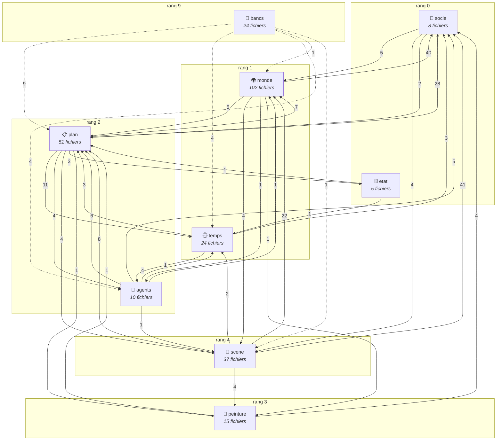

# Le graphe d'architecture — **généré**, jamais écrit à la main

> Produit par `python scripts/analyse/graphe_archi.py --doc` en lisant les
> imports Python, les `require` Node et les globales du navigateur, projetés
> sur la déclaration de [`containers.json`](containers.json). **Ne pas éditer :**
> toute correction se fait dans la déclaration ou dans le code, et l'on régénère.

Les intentions et les lois sont dans [`organisation.md`](organisation.md) ;
les boucles du jeu dans [`architecture.md`](architecture.md).

## Les containers et leurs liens

## Le tableau des liens

| de | vers | références | |
|---|---|---:|---|
| `scene` | `socle` | 41 |  |
| `monde` | `socle` | 40 |  |
| `plan` | `socle` | 28 |  |
| `scene` | `monde` | 22 |  |
| `plan` | `temps` | 11 |  |
| `bancs` | `plan` | 9 |  |
| `scene` | `plan` | 8 |  |
| `plan` | `monde` | 7 |  |
| `agents` | `plan` | 6 | ⚠️ remontée |
| `monde` | `plan` | 5 | ⚠️ remontée |
| `agents` | `socle` | 5 |  |
| `socle` | `monde` | 5 | ⚠️ remontée |
| `bancs` | `temps` | 4 |  |
| `bancs` | `agents` | 4 |  |
| `agents` | `temps` | 4 |  |
| `plan` | `agents` | 4 | ⚠️ remontée |
| `plan` | `scene` | 4 | ⚠️ remontée |
| `peinture` | `socle` | 4 |  |
| `scene` | `peinture` | 4 |  |
| `socle` | `scene` | 4 | ⚠️ remontée |
| `monde` | `scene` | 4 | ⚠️ remontée |
| `plan` | `etat` | 3 |  |
| `temps` | `plan` | 3 | ⚠️ remontée |
| `temps` | `socle` | 3 |  |
| `scene` | `temps` | 2 |  |
| `socle` | `plan` | 2 | ⚠️ remontée |
| `agents` | `monde` | 1 |  |
| `bancs` | `monde` | 1 |  |
| `etat` | `plan` | 1 | ⚠️ remontée |
| `etat` | `temps` | 1 | ⚠️ remontée |
| `peinture` | `plan` | 1 |  |
| `monde` | `agents` | 1 | ⚠️ remontée |
| `temps` | `agents` | 1 | ⚠️ remontée |
| `agents` | `scene` | 1 | ⚠️ remontée |
| `plan` | `peinture` | 1 | ⚠️ remontée |
| `monde` | `peinture` | 1 | ⚠️ remontée |
| `bancs` | `scene` | 1 |  |

## Les modules, par container

### 🗄️ etat — rang 0

*La seule verite : un fait qui n'y est pas ecrit n'existe pas*

**5 fichiers, 2187 lignes.** Porte : `scripts/etat/expose.py`

- **scripts/** (5) — `appliquer.py`, `tables.py`, `purger.py`, `ajouter.py`, `veille.py`

### 🔩 socle — rang 0

*Ce qui n'a pas de sujet et que tout le monde traverse : le transport, les chemins, le siege, la messagerie des ecrans*

**8 fichiers, 1664 lignes.** Porte : `serveur/http.js`

- **serveur/** (4) — `siege.js`, `contexte.js`, `dates.js`, `http.js`
- **ecrans/** (4) — `bus.js`, `nav.js`, `entites.js`, `loupe.js`

### 🌍 monde — rang 1

*La ville : masque, plan, bati, gens, relief — sa cuisson, son service et son ecran*

**102 fichiers, 39511 lignes.** Porte : `scripts/monde/expose.py`

- **scripts/** (57) — `plan_ville.py`, `peyredragon_interieurs.py`, `densifier.py`, `peupler.py`, `carte_geo.py`, `formes.py`, `coudre.py`, `peyredragon.py`, `besoins.py` … et 48 autres
- **serveur/** (9) — `monde3d.js`, `marche.js`, `carte.js`, `presence.js`, `monde-jeu.js`, `terrain.js`, `foule.js`, `chemin.js`, `marche.js`
- **ecrans/** (36) — `carte-ville.js`, `plan.js`, `foule2d.js`, `plans.js`, `carte.js`, `journee.js`, `gens.js`, `terrain.js`, `ville3d.js` … et 27 autres

### ⏱️ temps — rang 1

*Possede le temps hors-scene : horloges, echeances, diffusion — calcule et propose, ne decide jamais*

**24 fichiers, 7247 lignes.** Porte : `scripts/temps/expose.py`

- **scripts/** (23) — `presence.py`, `regence.py`, `evaluer.py`, `fenetre.py`, `occupation.py`, `ecrits.py`, `plan.py`, `sieges.py`, `rumeur.py` … et 14 autres
- **serveur/** (1) — `calendrier.js`

### 🧠 agents — rang 2

*LES SIEGES, humains comme PNJ : servir un point de vue, recevoir des actes, tenir un fil (le vecu), tenir un brouillard — deux profils (scene / journee), une machinerie*

**10 fichiers, 8459 lignes.** Porte : `scripts/agents/expose.py`

- **scripts/** (8) — `boucle_activation.py`, `depecher.py`, `affecter.py`, `parloir.py`, `dossier.py`, `juger.py`, `sieges.py`, `expose.py`
- **serveur/** (2) — `activations.js`, `regie.js`

### 📋 plan — rang 2

*Le Grand Plan : cahiers, couverture, criticite, levees — ce que les hommes ecrivent et ce qu'on en tire*

**51 fichiers, 18258 lignes.** Porte : `scripts/plan/expose.py`

- **scripts/** (24) — `criticite.py`, `etat_du_plan.py`, `couverture.py`, `mesures.py`, `tisser.py`, `normaliser_etats.py`, `scinder_moyens.py`, `plan_leves.py`, `corriger_plan.py` … et 15 autres
- **serveur/** (5) — `echiquier.js`, `atelier.js`, `agenda.js`, `livres.js`, `echiquier.js`
- **ecrans/** (22) — `echiquier.js`, `jetons.js`, `volume.js`, `renvois.js`, `coffret.js`, `marques.js`, `etagere.js`, `portee.js`, `renvois.js` … et 13 autres

### 🎨 peinture — rang 3

*Ce qui appelle une API payante : portraits, salles, voix, chansons*

**15 fichiers, 2670 lignes.** Porte : `scripts/peinture/expose.py`

- **scripts/** (11) — `gen_voix.py`, `figures.py`, `nappe.py`, `gen_salles.py`, `generer_chanson.py`, `figure_forces.py`, `medaillons.py`, `composer.py`, `audition_voix.py` … et 2 autres
- **serveur/** (4) — `voix.js`, `medias.js`, `portraits.js`, `voix.js`

### 📜 scene — rang 4

*LE RENDU du profil scene : le flux, l'inbox, la montre, la mise en scene — ce que le joueur voit ; personne ne la lit*

**37 fichiers, 7950 lignes.** Porte : `scripts/scene/expose.py`

- **scripts/** (5) — `append_flux.py`, `tunnel.py`, `regie.py`, `seed_flux.py`, `expose.py`
- **serveur/** (7) — `fils.js`, `action.js`, `bibliotheque.js`, `piece.js`, `scene.js`, `joueur.js`, `serveur.js`
- **ecrans/** (25) — `son.js`, `nappe.js`, `calendrier.js`, `illustration.js`, `galerie.js`, `voix.js`, `actions.js`, `regie.js`, `visage.js` … et 16 autres

### 🔬 bancs — rang 9

*Ils lisent tout et n'ecrivent rien : gardes, mesures, etalons, audit*

**24 fichiers, 5457 lignes.** Porte : `scripts/verifier.mjs`

- **scripts/** (20) — `croisement.py`, `exporter_aurore.py`, `parvenir.py`, `simuler_reveil_maisons.py`, `graphe_archi.py`, `verifier.mjs`, `essai_occupation.py`, `scorer_activation_hightower.py`, `chercher_activation_hightower.py` … et 11 autres
- **serveur/** (4) — `test_siege.js`, `test_marche.js`, `test_piece_http.js`, `test_bibliotheque.js`

## Les écarts à la cible

| écart | compte | ce que ça veut dire |
|---|---:|---|
| orphelins | 0 | un fichier qu'aucun container ne réclame |
| liens hors porte | 207 | un lien qui entre ailleurs que par la porte |
| dépendances qui remontent | 16 | violation de la loi 2 (rangs) |
| commandes-bibliothèques | 0 | une commande racine importée comme module |

Ces quatre chiffres ne doivent que **descendre**. Ils sont la distance entre
la cible déclarée et le câblage réel — le chantier, en nombres.
