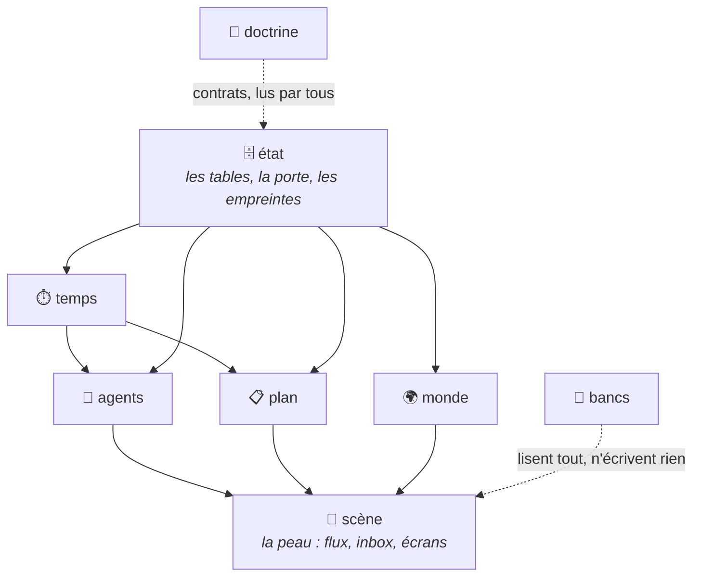

# L'organisation du code — containers, portes, façades

**Proposition, rien n'est acté.** Elle se discute avant qu'un fichier bouge.

Ce document ne parle pas de ce qui se passe dans le jeu — c'est le travail de [`architecture.md`](architecture.md), qui décrit la boucle des sièges (deux profils), la boucle du temps et leurs invariants. Celui-ci dit **où vit le code, par quelle porte on y entre, et ce qui empêche un sujet de s'éparpiller**. Les deux se lisent ensemble : l'un est la physiologie, l'autre l'anatomie.

---

## 1. Le diagnostic — ce n'est pas un problème de dossiers

Les dossiers viennent d'être rangés (`657cfb3` : dix dossiers sous `scripts/`, chacun avec sa fiche ; `9d376f4` : le serveur en vingt et une routes). Le rangement était juste et il tient. Ce qui manque est ailleurs, et se mesure en trois chiffres.

### ① Onze commandes sont aussi des bibliothèques

La règle posée par `scripts/CLAUDE.md` est bonne : *la racine est l'interface — ce qui est TAPÉ —, les dossiers sont le reste, et `noyau/` est le seul dossier importable.* Elle est déjà contournée par le code lui-même :

| commande racine | taille | importée par |
|---|---|---|
| `couverture.py` | 1 057 l. | **8 fichiers** |
| `occupation.py` | 501 l. | 5 |
| `regence.py` | 817 l. | 3 |
| `tick.py` | 3 214 l. | 2 |
| `affecter.py` | 861 l. | 2 |
| `depecher.py`, `ajouter.py`, `mesures.py`, `tisser.py` | — | 1 chacune |

Les commandes qui restent à la fois interfaces et bibliothèques doivent continuer à converger vers des façades minces. Le moteur automatique des activités, ancien exemple majeur de ce problème, a été supprimé.

### ② Un sujet vit à six adresses, et rien ne le déclare

La ville — cuisson des masques, plan, bâti, gens, journées, relief, rendu :

```
scripts/monde/                20 317 l.    la cuisson, le plan, le peuplement
scripts/materialisation/       4 281 l.    les formes, les intérieurs
scripts/ville/                 1 489 l.    la voirie
ecrans/modules/monde/          5 157 l.    ce que la page en dessine
ecrans/modules/carte-ville.js  1 786 l.    la carte
serveur/monde3d.js               954 l.    ce que le serveur en sert
                              ─────────
                              33 984 l.    pour UN sujet
```

Aucun fichier ne dit que ces six adresses forment un tout. Un changement de format du masque touche les six ; rien ne le signale, et rien ne dit par où l'on entre. C'était la même dispersion pour le moteur de bataille (quatre adresses, depuis sorti du dépôt — voir §6 D1) et c'est encore celle du plan (trois).

### ③ Côté navigateur, la porte existe mais n'est pas une règle

**64 globales `window.*`** pour 110 fichiers en IIFE. Mais `books/` vient de démontrer le motif juste : quatorze modules dans un dossier, **une seule** globale posée par `books.js` qui monte l'assemblage. Le motif est trouvé, il n'est écrit nulle part comme règle — donc le fichier suivant ne le suivra pas.

---

## 2. La règle proposée — une seule, dans les trois mondes

> **Un container = un dossier + une porte + une fiche.**
> On n'entre dans un container que par sa porte. Ce qui est derrière la porte n'a pas de chemin public.

Le dépôt exécute du code dans trois mondes ; la porte prend trois formes, la règle ne change pas.

| monde | la porte | ce que ça interdit |
|---|---|---|
| **Python** (le hors-scène, les agents) | `<container>/expose.py` — les seules fonctions importables | `from tick import ...` : on importe le container, jamais une commande |
| **Node** (le serveur, les fours) | `<container>/index.js` | `require("../autre/interne.js")` |
| **Navigateur** (les écrans) | le fichier qui pose **la** globale du dossier, comme `books/books.js` | qu'un module interne pose sa propre globale |

Et la conséquence directe sur les trente-huit commandes :

> **Une commande est une façade.** Elle lit ses arguments, appelle une porte, imprime. Elle ne contient pas de logique — donc plus personne n'a de raison de l'importer.

C'est le `expose.js` de `batailles` transposé : là-bas, `main.js` est le seul fichier qui connaît tous les containers et les compose par injection ; ici, chaque commande est un petit `main` qui compose ce dont son verbe a besoin. Le chemin `scripts/tick.py` reste gelé pour l'éternité — il ne fait plus que trente lignes.

---

## 3. Les containers proposés

Six containers de **sujet**, deux transverses. Chacun possède son sujet **de bout en bout** — du calcul Python à ce que la page en dessine.

> **Pourquoi par sujet et non par couche technique** (calcul / service / rendu) ? Parce que la douleur mesurée est la dispersion d'un sujet à six adresses (§1②), pas le mélange calcul-rendu. Le rendu est d'ailleurs déjà séparé par le protocole : le serveur sert du JSON, la page le dessine — la frontière technique existe sans qu'on ait à la faire porter par l'arborescence. C'est un écart assumé avec `batailles`, où la Présentation est un container à part : là-bas il y a un seul sujet, ici il y en a six.

| Container | Possède | Aujourd'hui éparpillé dans |
|---|---|---|
| 🗄️ **état** | les tables et les outils d'entrée, de lecture et de purge | `noyau/tables.py`, `ajouter.py`, `purger.py` |
| ⏱️ **temps** | horloges, échéances, diffusion à livrer, présence, disponibilité | `tick.py`, `occupation.py`, `regence.py`, `presence.py`, `evaluer.py` |
| 🧠 **agents** | briefs, dépêche explicite, parloir, jugement, greffe documentaire | `depecher.py`, `parloir.py`, `juger.py`, `veille.py`, `affecter.py` |
| 📋 **plan** | cahiers, couverture, criticité, levées, renvois, exports | `criticite.py`, `couverture.py`, `etat_du_plan.py`, `plan/`, `tisser.py`, `mesures.py` |
| 🌍 **monde** | la ville : masque, plan, bâti, gens, journées, relief, sa carte et son 3D | `monde/`, `materialisation/`, `ville/`, `ecrans/modules/monde/`, `carte-ville.js`, `serveur/monde3d.js` |
| 📜 **scène** | le flux, l'inbox, la montre, les items et leur rendu | `append_flux.py`, `tunnel.py`, `fils.py`, `serveur/routes/`, `ecrans/modules/*.js` (le guetteur est mort — habitant.md pas 5) |
| 📐 **doctrine** | les contrats : `schema.md` (intouchable), `agents/prompts/metier.md`, les fiches | `docs/` |
| 🔬 **bancs** | gardes, mesures, étalons, l'audit | `verifier.mjs`, `scripts/tests/`, `banc-*.js`, `analyse/` |

### L'invariant du siège *(décision du 30 — la synthèse qui unifie la boucle)*

> **Un acteur — humain ou PNJ — est un SIÈGE.** Quatre choses le font : un *point de vue servi* (la scène rendue / le brief), un *canal d'action* (l'inbox / les écrits + propositions), un *fil propre* (le flux par siège / le vécu), un *brouillard* (`info.json` par siège / croyances + diffusion). L'unique MJ arbitre devant tous les sièges. Les deux boucles d'`architecture.md` (jeu, agents) sont **une boucle, deux profils** : temps de scène et journée.

C'était déjà latent : `sieges.py` s'annonce « s'asseoir dans un personnage, en quitter un », et *Laisser faire* est la bascule de profil d'un siège. Trois asymétries restent nommées pour que l'unification ne devienne pas une bouillie : la **cadence** (minutes de scène / journées), le **rendu** (mise en scène / dossier), la **Règle Zéro** (les paroles du PNJ sont protégées par la dépêche ; le joueur écrit les siennes librement).

Conséquences sur les containers : l'intention d'🧠 `agents` est réécrite (« les sièges, humains comme PNJ ») et `sieges.py` y passe (depuis `scene`) ; 📜 `scène` se resserre sur le **rendu du profil scène**. **C'est aussi le principe de découpage du lot 2 d'`agents/`** : la partie générique n'est pas « générique au rôle dépêché », elle est générique au *siège* — servir un point de vue, recevoir des actes, tenir un fil, tenir un brouillard ; le chemin joueur et le chemin PNJ deviennent deux profils de la même porte. Tension laissée ouverte : `serveur/siege.js` (le brouillard *en lecture*, 12 lecteurs) reste au `socle` — le siège-lecture n'est pas le siège-machinerie ; à réexaminer quand `agents` s'éclatera.

### La forme d'un container

```
<container>/
  CLAUDE.md          intention, décisions actées, frontières, ce qu'il fournit
  expose.py          LA PORTE — les seules fonctions que les autres importent
  <module>.py        la matière, nommée par ce qu'elle sait (jamais « utils »)
  service/           ce que le serveur en sert (routes Node)
  ecran/             ce que la page en dessine (une globale, posée par la porte)
  banc/              son étalon
```

Tous les dossiers ne sont pas peuplés : `temps` n'a pas d'écran, `scène` n'a presque que ça.

### Les deux lois de dépendance

1. **On n'importe qu'une porte.** Un container peut importer la porte d'un autre ; jamais un module interne, jamais une commande.
2. **La dépendance ne remonte pas.** 🗄️ état ne connaît personne. ⏱️ temps et 🌍 monde ne connaissent que lui. 🧠 agents et 📋 plan connaissent état + temps. 📜 scène connaît tout le monde et **personne ne le connaît** — c'est la peau.



---

## 4. Ce que ça change concrètement, sur trois exemples

**`tick.py`** (3 214 l., importé par 2, gelé dans les docs) devient une façade de ~30 lignes qui appelle `temps/expose.py`. Ses satellites — échéances, diffusion, horloges, gardes du `--verifier` — deviennent des modules nommés du container `temps`.

**La ville** cesse d'avoir six adresses : un container `monde/` avec sa cuisson, son service et son écran. Un changement de format du masque a **un** point d'entrée et **une** fiche qui dit qui en dépend.

**`books/`** (déjà fait, sans le nommer) devient l'exemple canonique : quatorze modules, une porte, aucune autre globale. La fiche qu'il n'a pas encore dirait ce que la porte garantit.

---

## 5. Le chemin — trois lots, aucun big bang

Cent vingt-sept mille lignes ne se déplacent pas en un geste, et un déplacement de blocs est précisément ce qu'on ne sait pas vérifier — c'est le diagnostic qui a fait naître `banc-moteur`. D'où l'ordre : **le filet d'abord, les portes ensuite, les déménagements en dernier.**

### Lot 1 — les portes, sans déplacer un fichier *(~1 jour)*

Créer `expose.py` dans chaque container **là où les fichiers sont déjà** : la porte réexporte ce que les onze commandes-bibliothèques offrent aujourd'hui, les importeurs basculent dessus. Rien ne bouge sur le disque, mais plus personne n'importe une commande.

**La mesure qui dit qu'on converge**, à poser dans `verifier.mjs` le même jour :

```
·  portes   11   commandes racine importees comme modules — ne doit que descendre
```

C'est la leçon de l'audit du 30 : *le compteur qui n'existe pas est celui qui dérive.* Le dépôt en a déjà deux qui marchent (`porte-etat` à 43, `banc-epreuve` à 4).

### Lot 2 — vider les façades *(par commande, une par commit)*

Descendre la matière de chaque commande dans les modules de son container ; la commande garde son verbe et ses arguments. Le hook `taille.js` est un cliquet — chaque descente abaisse définitivement un plafond.

**L'ordre n'est PAS la taille — il est tiré par les features** (décision du 30, voir « Où atterrissent les features » ci-dessous) : on éclate un container *au moment où une feature le force à trouver ses bons noms de modules*, jamais avant. Un éclatement « pur », fait à froid, produit des noms qu'on renomme trois semaines plus tard — c'est le deuxième refactor qu'on veut éviter, et on l'évite en ne faisant jamais d'éclatement sans consommateur.

**La garde qui rend le lot irréversible** : une façade dépasse 60 lignes → mesure.

### Lot 3 — le regroupement par sujet *(re-scopé le 30 août 2026)*

Ce lot était gaté sur « `chaine.js` pose les balises » (§2.1 de l'audit) — or **`chaine.js` est mort avec le moteur de bataille**, sorti du dépôt le 30 août 2026 : le gate tel qu'écrit ne peut plus advenir. Le périmètre restant : **distribuer les écrans survivants entre `monde`, `plan` et `scene`**, selon la table de §7. Le danger, lui, n'a pas bougé : tant que les chemins `/modules/*.js` sont écrits à la main dans les HTML, chaque déplacement est une occasion de casser une page en silence. Deux formes possibles du nouveau gate, à trancher : **(a)** créer un manifeste de balises pour `jeu.html` — une liste unique qui pose les `<script>`, pour qu'un fichier puisse changer d'adresse sans qu'aucune page ne le sache ; **(b)** décider explicitement de s'en passer — les déplacements se font alors à la main, HTML par HTML, en assumant le risque de casse silencieuse.

### Où atterrissent les features prévues — le test de robustesse *(décision du 30)*

La question a été posée : faut-il ce refactor, puis un second pour les features en tête (les hommes qui se parlent, les MJs dépêchés par `claude -p` avec prompt dédié) ? **Réponse : un seul refactor — parce que chaque feature atterrit dans les containers déclarés sans en déplacer un.** La vérification, feature par feature :

| feature en tête | où elle atterrit | change la structure ? |
|---|---|---|
| bruit de fond (deux co-présents se sont parlé → entrée de `diffusion` canal rumeur/témoin, zéro appel LLM) | ⏱️ `temps` (le tick pose les entrées) + 🗄️ `etat` (la table existe) | non — un module de plus |
| le billet (un homme écrit *à* quelqu'un ; arrive au brief de sa prochaine dépêche) | 🧠 `agents` (le brief) + 🗄️ `etat` (plis) | non |
| rencontres jouées (tours alternés sur les sessions `--resume` existantes, fil au parloir) | 🧠 `agents` (`rencontres.py`, `election.py`) + 📜 `scene` (le greffage : événement + témoins + diffusion) | non |
| le **vécu** (un fil par homme, pour le debug : index chronologique ancré — jamais une source ; les gestes archivés depuis `depouiller()` au hook Stop, le seul morceau périssable) | 🧠 `agents` (c'est son `introspect()` — le seul container sans viz) + 🗄️ `etat` (`journaux/<homme>/`) | non — et il passe AVANT rencontres et MJs : leur debug en dépendra, et un MJ-rôle hérite d'un vécu gratuitement |
| MJs via `claude -p`, prompt dédié (un MJ devient un **rôle** de la même machinerie que les hommes) | 🧠 `agents` (la dépêche se généralise : `depecher(rôle, manuel)`) + 📐 `doctrine` (les manuels par rôle, comme `agents/prompts/metier.md`) | **non structurel — mais c'est LA feature qui doit informer l'éclatement d'`agents`** : séparer le générique au rôle (session, resume, brief, retour, jugement) du propre à l'homme (greffe, tête, pensées) |

D'où **le refactor en deux vitesses** (et pas deux refactors) :

1. **Lot 1 partout, tout de suite** — neutre aux features par construction (rien ne bouge, on réexporte) ;
2. **Lot 2 par container, tiré par les features** — `agents/` s'éclate au moment des MJs dédiés et des rencontres, `temps/` au moment du bruit de fond ;
3. le bruit de fond et le billet ne dépendent pas du lot 2 : ils suivent le lot 1 directement.

Le piège symétrique est aussi écarté : attendre la fin du design des features pour refactorer bloquerait tout — poser des portes n'exige pas que la granularité des rencontres soit mûre.

---

## 6. Les quatre décisions — D1 tranchée par le fait, les trois autres ouvertes

**D1 — `⚔️ bataille` est-il un container, ou un appel ? — TRANCHÉ : ni l'un ni l'autre, il sort.** La question portait sur un moteur de 28 000 lignes (10 511 + 14 419 + 3 177 l.) destiné à être remplacé par des appels au dépôt voisin `batailles`. La réponse est tombée par le fait, le **30 août 2026** : le moteur a été **supprimé du dépôt** — écrans, modules, scripts, routes, archives, `etat/bataille.json`, le container de `docs/containers.json` et douze épreuves du manifeste de `verifier.mjs`. Le remplacement se fera par des appels à `batailles/src` ; **la forme de ce branchement reste à décider et n'est écrite nulle part.**

Ce que la décision a coûté et ce qu'elle garde : on avait acté la porte plutôt que le container jetable, en pariant qu'une porte devient l'adaptateur le jour de la bascule. La bascule est arrivée avant que la porte n'existe, et le retrait s'est donc fait par suppression franche plutôt que par substitution — **28 000 lignes sans porte se remplacent par un chantier**, et ce chantier est celui qui reste ouvert aujourd'hui. La leçon vaut pour le prochain sujet qu'on saura mortel : lui donner sa porte AVANT de savoir la date.

**D2 — Une porte Python ou un paquet ?** `expose.py` par container est simple et se lit ; un vrai paquet (`from conseil.temps import ...`) donnerait des imports vérifiables par un outil et supprimerait les **59 `sys.path.insert`** — mais touche l'amorce de tous les fichiers, et le `pyproject.toml` existe déjà pour ça. *Penche pour le paquet*, en une passe, après le lot 1.

**D3 — Où va `scripts/monde/` ?** C'est le plus gros paquet du dépôt (20 317 l.) et il n'est pas du même métier que le reste : c'est de la **cuisson hors ligne** (masques, plans, peuplement), pas du jeu. Container à part entière, ou dossier `four/` du container `monde` ? *Penche pour la seconde* : ce qu'il produit est lu par le monde, sa cuisson n'a pas d'autre client.

**D4 — Les containers sont-ils des dossiers de premier niveau ?** Aujourd'hui l'arborescence est par **langue** (`scripts/`, `serveur/`, `ecrans/`), et la proposition est par **sujet** — les deux ne peuvent pas être vraies au même niveau. Trois options : (a) sujets à la racine, les langues descendent dedans — le plus juste, le plus cher (tous les chemins tapés bougent : impossible, §1①) ; (b) les langues restent, un container est un **triplet nommé** (`scripts/temps/`, `serveur/temps/`, `ecrans/temps/`) que sa fiche unique déclare — praticable, mais la fiche doit exister ou le lien est fictif ; (c) statu quo enrichi : les fiches déclarent les rattachements sans rien bouger. *Penche pour (b)* : c'est ce que faisait déjà le moteur de bataille sans le dire.

---

## 7. L'arborescence cible — **D4 (b)** et **D1** actés

> **D4 acté — le container est un triplet nommé.** Les trois racines restent (`scripts/`, `serveur/`, `ecrans/`) parce que les chemins tapés sont gelés ; un container est **le même nom porté dans les trois**, et **une seule fiche** — `scripts/<nom>/CLAUDE.md` — le déclare de bout en bout. Sans cette fiche, le triplet est fictif : c'est elle qui fait le container, pas la coïncidence de nom.
>
> **D1 acté — le moteur de bataille est sorti du dépôt** (30 août 2026). L'arbre ci-dessous ne porte donc plus de container `bataille` ; ce qui le remplacera sera un appel à `batailles/src`, dont la forme reste à décider (§6 D1).

### Les trois racines

```
scripts/                        L'INTERFACE + le calcul
  <les 38 commandes>            façades gelées : lire les arguments, appeler une porte, imprimer
  etat/  temps/  agents/  plan/  monde/  scene/  peinture/  bancs/
      CLAUDE.md                 LA FICHE — déclare le container dans les trois racines
      expose.py                 LA PORTE — les seules fonctions importables
      <modules>.py              la matière, nommée par ce qu'elle sait

serveur/                        CE QUE LE SERVEUR EN SERT
  serveur.js  http.js  contexte.js        le socle (65 + 45 + 117 l.)
  <container>/                            les routes du container, index.js = sa porte

ecrans/                         CE QUE LA PAGE EN DESSINE
  jeu.html …
  modules/
    <container>/                un dossier = UNE globale, posée par la porte
```

### Le détail, container par container

```
scripts/etat/            🗄️  les tables et leurs outils
  expose.py                  lire · ecrire · empreinte
  tables.py                  ← noyau/tables.py            (la porte de etat/, déjà écrite)
  entree.py                  ← ajouter.py
  empreintes.py              ← veille.py
  purge.py                   ← purger.py

scripts/temps/           ⏱️  horloges, échéances, diffusion, disponibilité
  expose.py
  horloges.py  echeances.py  diffusion.py  gardes.py    ← tick.py           (3 214 l. éclatées)
  occupation.py            ← occupation.py
  regence.py               ← regence.py
  presence.py              ← presence.py
  disponibilite.py         ← evaluer.py                 ⚠ ou plan/ — voir §8
  calendrier.py            ← noyau/jours_relatifs.py
  reprise.py               ← reprise.py

scripts/agents/          🧠  briefs, dépêche, parloir, jugement
  expose.py
  brief.py  manuel.py  retour.py    ← depecher.py        (2 062 l. éclatées)
  parloir.py                        ← parloir.py
  jugement.py                       ← juger.py
  matiere.py                        ← dossier.py
  affectation.py                    ← affecter.py

scripts/plan/            📋  cahiers, couverture, criticité, levées
  expose.py
  bibliotheque.py          ← noyau/bibliotheque.py       (24 importeurs : le vrai transverse)
  livre.py  modele.py  rapporteurs.py   ← noyau/
  couverture.py            ← couverture.py               (importée par 8)
  criticite.py             ← criticite.py
  etat_du_plan.py  mesures.py  tisser.py  chiffrer.py  fils.py
  verser_cahier.py  exporter_plan.py  passer.py
  corriger.py  normaliser.py  leves.py  renvois.py  moyens.py  dater.py   ← plan/*

scripts/monde/           🌍  la ville : masque, plan, bâti, gens, relief
  expose.py
  four/                    ← monde/*              LA CUISSON hors ligne (20 317 l.) — D3
      plan_ville.py  densifier.py  peupler.py  coudre.py  besoins.py  organique.py …
  formes/                  ← materialisation/*    (4 281 l.)
  voirie/                  ← ville/*              (1 489 l.)
  geographie.py            ← carte_geo.py
  arpentage.py             ← arpenter.py
  corps.py                 ← corps.py
  trajets.py               ← marche.py
  carte_muette.py          ← noyau/carte_muette.py

scripts/scene/           📜  le flux, l'inbox, la montre, les sièges
  expose.py
  flux.py                  ← append_flux.py
  tunnel.py  regie.py  sieges.py  seed_flux.py
  (guetteur.sh : mort le 30.8 — remplace par le reveil habitant du serveur, habitant.md pas 5)

(bataille)               ⚔️  = des appels au dépôt voisin `batailles` — la porte viendra avec ses peaux (voir sa proposition `coding/PROPOSITION-moteur-appele.md`)

scripts/peinture/        🎨  ce qui appelle une API payante (fiche déjà écrite)
  expose.py                    portraits · salles · voix · chansons · médaillons
  ← peinture/* + composer.py

scripts/bancs/           🔬  gardes, mesures, étalons
  verifier.mjs             ← scripts/verifier.mjs
  tests/                   ← scripts/tests/
  analyse/                 ← scripts/analyse/  (dont audit_technique.py)
  migrations/              ← scripts/migrations/   ⚠ ou un dossier à soi
```

```
serveur/
  serveur.js  http.js  contexte.js  dates.js            le socle, sans sujet
  scene/     index.js  scene.js action.js piece.js fils.js joueur.js voix.js medias.js
  monde/     index.js  carte.js terrain.js chemin.js foule.js monde-jeu.js monde3d.js presence.js
  plan/      index.js  livres.js echiquier.js agenda.js atelier.js marche.js
  temps/     index.js  calendrier.js
  agents/    index.js  activations.js regie.js
```

```
ecrans/modules/
  scene/      actions attention defilement demandes entites fils galerie gestes narration
              nav paroles pensees regie reglages suites visage vue-salle vus son voix
              illustration loupe lumiere nappe blasons calendrier sieges
  monde/      carte carte-ville carte-ville-theme carte-projection terrain ville3d geo
              foule2d plan plans reperes gens taches  + le monde/ actuel (journee, relief, nefs…)
  plan/       books/ echiquier jetons renvois retrospective desseins objectifs ecrits annales
  socle/      bus  (le seul module sans sujet : la messagerie interne des écrans)
```

### Ce que l'arbre fait disparaître

- **`noyau/` n'existe plus.** C'était le nom d'une commodité — « le seul dossier importable » — et cette commodité devient inutile quand chaque container a sa porte. Ses huit modules se rangent tous : `tables`→état, `bibliotheque`/`livre`/`plan_modele`/`rapporteurs`→plan, `jours_relatifs`→temps, `carte_muette`→monde, `chiffrer`→plan.
- **Pas de `commun/`, pas d'`utils/`.** J'ai cherché ce qui serait vraiment transverse : rien ne l'est. `bibliotheque.py` a 24 importeurs mais un sujet net (les cahiers) — il vit dans `plan` et les autres passent par sa porte. Si un `commun/` devait naître un jour, la règle qui le garde honnête est : *rien n'y entre qui ne serve à trois containers.*
- **Les six adresses de la ville deviennent trois** (une par racine), déclarées par une fiche.

## 8. Les rattachements à trancher — huit cas, pas plus

L'arbre ci-dessus range 100 % des fichiers ; huit rattachements sont défendables autrement, et ce sont les seuls qui méritent qu'on en parle.

| # | Le cas | L'alternative |
|---|---|---|
| ① | `evaluer.py` — « qui a du temps » | **temps** (la disponibilité est une horloge) ou **plan** (sa docstring parle de goulots et de coûts) |
| ② | `echiquier` / `jetons` — la table de guerre | **plan** (des croyances datées sur les affaires) ou **scene** (une échelle du décor, ouverte partout) |
| ③ | `annales.js` — « ce que l'Histoire retiendra » | **plan** ou **scene** |
| ④ | `composer.py` — poser une chanson | **peinture** (elle appelle l'API) ou **scene** (c'est un geste du MJ) |
| ⑤ | `migrations/` | **bancs** (ça ne tourne qu'une fois, comme un étalon) ou un dossier à soi, hors containers |
| ⑥ | `figures/` — les SVG du mestre | **peinture** ou **plan** (elles illustrent des cahiers) |
| ⑦ | `bus.js` — la messagerie des écrans | `modules/socle/` ou une porte du container `scene` |
| ⑧ | **`fils.py` ≠ `fils.js`** | Homonymie franche : l'un est *les affaires en cours* (plan), l'autre *le fil du récit* (scene). Deux containers, un seul mot — à renommer avant que le triplet ne le fige |

Aucun de ces huit ne bloque le lot 1 : les portes se posent là où les fichiers sont.

## 9. Le premier pas

**Le lot 1, et rien d'autre** : neuf `expose.py`, les onze importeurs basculés, la mesure `portes` dans `verifier.mjs`. Aucun fichier déplacé, aucun chemin cassé, le compteur passe de 11 à 0 et ne peut plus remonter sans se voir.

C'est aussi le lot qui rend les deux autres possibles : tant qu'une commande est une bibliothèque, la vider (lot 2) casserait ses importeurs, et la déplacer (lot 3) casserait un cahier.
